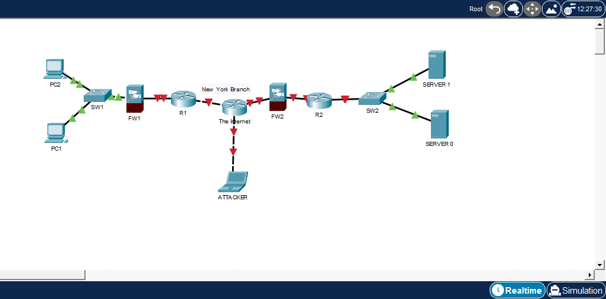

# 01 - Network Fundamentals

This lab introduces the basic building blocks of a computer network using Cisco Packet Tracer.  
The objective is to understand common network devices, basic topology design, and how different devices are connected together.

## Lab Topic

**Packet Tracer Introduction and Basic Network Topology**

## Objectives

- Build a basic network topology from scratch
- Identify the role of each network device
- Connect routers, switches, PCs, servers, firewalls, and end devices
- Understand how different devices fit inside a small enterprise network
- Practice organizing a topology clearly inside Cisco Packet Tracer

## Devices Used

- 2 Cisco 2911 routers
- 2 Cisco 2960 switches
- 2 Cisco 5505 firewalls
- 2 PCs
- 2 servers
- 1 laptop used as an attacker/testing device

## Topology

## What I Practiced

In this lab, I practiced creating a basic network topology and connecting devices using Packet Tracer.  
The focus was on understanding the role of each device before moving into IP addressing, switching, routing, and security configuration.

## Device Roles

| Device | Role |
|---|---|
| Router | Connects different networks together |
| Switch | Connects devices inside the same LAN |
| Firewall | Controls and filters network traffic |
| PC | End-user device |
| Server | Provides network services |
| Laptop | Used as a testing/attacker device |

## Files Included

| File | Description |
|---|---|
| `lab-packet-tracer-introduction.pkt` | Cisco Packet Tracer lab file |
| `lab-01-network-topology.png` | Topology screenshot |
| `README.md` | Lab explanation |

## Skills Demonstrated

- Basic Cisco Packet Tracer usage
- Network device placement
- Physical/logical topology design
- Understanding of common enterprise network devices
- Clean lab documentation using GitHub Markdown

## Notes

This is the first lab in my CCNA learning path.  
More advanced labs will include IP addressing, switching, static routing, dynamic routing, VLANs, ACLs, NAT, DHCP, and troubleshooting.
