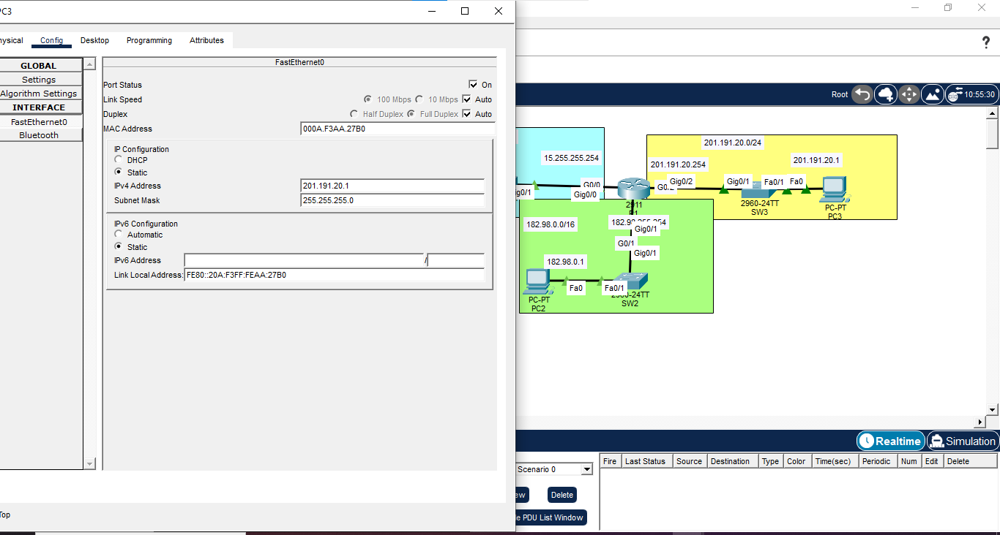
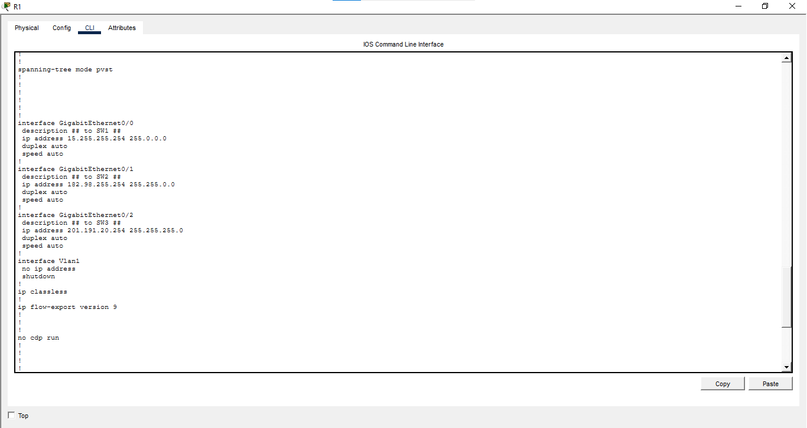
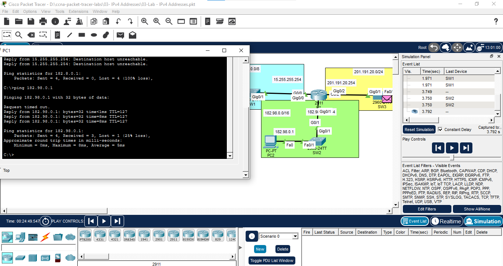
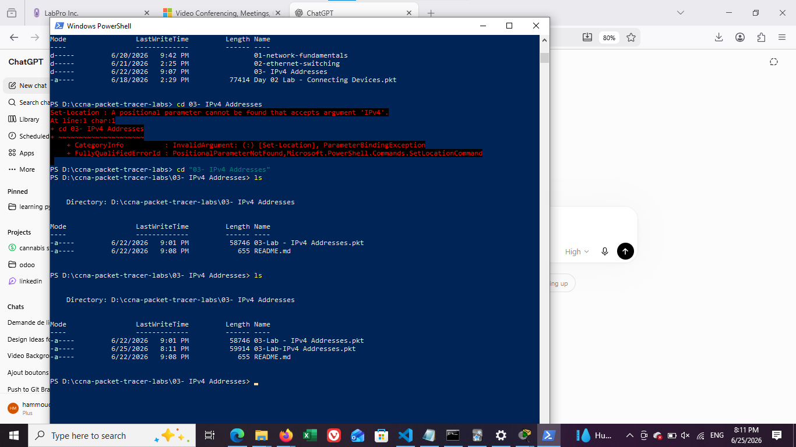

# Lab 03 – IPv4 Addressing

## Overview

This Packet Tracer lab demonstrates how to configure IPv4 addresses on end devices and router interfaces, connect three different IPv4 networks, and verify communication between them.

The router **R1** provides Layer 3 connectivity between the following LANs:

| Network | Prefix | Subnet Mask | Router Interface | Default Gateway |
|---|---:|---|---|---|
| `15.0.0.0` | `/8` | `255.0.0.0` | `GigabitEthernet0/0` | `15.255.255.254` |
| `182.98.0.0` | `/16` | `255.255.0.0` | `GigabitEthernet0/1` | `182.98.255.254` |
| `201.191.20.0` | `/24` | `255.255.255.0` | `GigabitEthernet0/2` | `201.191.20.254` |

---

## Topology

The topology contains:

- One Cisco 2911 router
- Three Cisco 2960 switches
- Three PCs
- Three separate IPv4 LANs

Each switch connects one PC to one routed interface on R1.

---

## End-Device Addressing

| Device | IPv4 Address | Subnet Mask | Default Gateway |
|---|---|---|---|
| PC1 | `15.0.0.1` | `255.0.0.0` | `15.255.255.254` |
| PC2 | `182.98.0.1` | `255.255.0.0` | `182.98.255.254` |
| PC3 | `201.191.20.1` | `255.255.255.0` | `201.191.20.254` |

### PC3 IPv4 configuration



---

## Router Configuration

R1 was configured with one IPv4 address in each connected network.

```cisco
enable
configure terminal

interface GigabitEthernet0/0
 description TO-SW1
 ip address 15.255.255.254 255.0.0.0
 no shutdown
 exit

interface GigabitEthernet0/1
 description TO-SW2
 ip address 182.98.255.254 255.255.0.0
 no shutdown
 exit

interface GigabitEthernet0/2
 description TO-SW3
 ip address 201.191.20.254 255.255.255.0
 no shutdown
 exit

end
copy running-config startup-config
```

### R1 interface configuration



---

## Verification Commands

The following commands can be used to verify the router configuration:

```cisco
show ip interface brief
show running-config
show ip route
show interfaces description
```

Expected connected routes:

```text
15.0.0.0/8 is directly connected, GigabitEthernet0/0
182.98.0.0/16 is directly connected, GigabitEthernet0/1
201.191.20.0/24 is directly connected, GigabitEthernet0/2
```

---

## Connectivity Tests

From PC1, connectivity can be tested with:

```text
ping 15.255.255.254
ping 182.98.0.1
ping 201.191.20.1
```

From PC2:

```text
ping 182.98.255.254
ping 15.0.0.1
ping 201.191.20.1
```

From PC3:

```text
ping 201.191.20.254
ping 15.0.0.1
ping 182.98.0.1
```

### Successful inter-network ping



The first ping may fail while the PC and router resolve MAC addresses using ARP. After the ARP tables are populated, the following echo requests should succeed.

---

## What This Lab Demonstrates

- Assigning static IPv4 addresses to PCs
- Selecting the correct subnet mask for `/8`, `/16`, and `/24` networks
- Configuring router interfaces as default gateways
- Enabling router interfaces with `no shutdown`
- Routing between directly connected networks
- Verifying connectivity with `ping`
- Understanding the initial ARP resolution delay

---

## Project Files

```text
03-IPv4-Addresses/
├── 03-Lab-IPV4-Addresses.pkt
├── README.md
└── images/
    ├── pc3-ipv4-configuration.png
    ├── router-r1-interface-configuration.png
    ├── inter-network-ping-test.png
    └── project-files-powershell.png
```

### Local project files



---

## Repository Commands

```powershell
git add .
git commit -m "Add IPv4 addressing Packet Tracer lab"
git push
```
