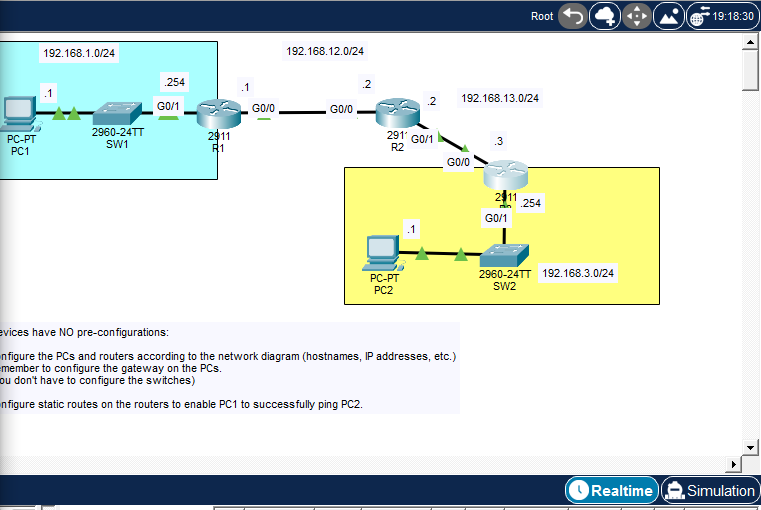

# Lab 02 — Three-Router Static Routing

## Objective

Configure IPv4 addressing and static routes so that **PC1** on `192.168.1.0/24`
can communicate with **PC2** on `192.168.3.0/24` through **R1, R2, and R3**.



## Topology

```text
PC1 --- SW1 --- R1 -------- R2 -------- R3 --- SW2 --- PC2
192.168.1.0/24   192.168.12.0/24   192.168.13.0/24   192.168.3.0/24
```

## Addressing Table

| Device | Interface | IPv4 Address | Subnet Mask | Default Gateway |
|---|---|---:|---:|---:|
| PC1 | FastEthernet0 | `192.168.1.1` | `255.255.255.0` | `192.168.1.254` |
| R1 | G0/1 | `192.168.1.254` | `255.255.255.0` | N/A |
| R1 | G0/0 | `192.168.12.1` | `255.255.255.0` | N/A |
| R2 | G0/0 | `192.168.12.2` | `255.255.255.0` | N/A |
| R2 | G0/1 | `192.168.13.2` | `255.255.255.0` | N/A |
| R3 | G0/0 | `192.168.13.3` | `255.255.255.0` | N/A |
| R3 | G0/1 | `192.168.3.254` | `255.255.255.0` | N/A |
| PC2 | FastEthernet0 | `192.168.3.1` | `255.255.255.0` | `192.168.3.254` |

## Router Configurations

### R1

```cisco
enable
configure terminal
hostname R1

interface g0/1
 description ## TO SW1 ##
 ip address 192.168.1.254 255.255.255.0
 no shutdown
 exit

interface g0/0
 description ## TO R2 ##
 ip address 192.168.12.1 255.255.255.0
 no shutdown
 exit

ip route 192.168.3.0 255.255.255.0 192.168.12.2

end
write memory
```

### R2

```cisco
enable
configure terminal
hostname R2

interface g0/0
 description ## TO R1 ##
 ip address 192.168.12.2 255.255.255.0
 no shutdown
 exit

interface g0/1
 description ## TO R3 ##
 ip address 192.168.13.2 255.255.255.0
 no shutdown
 exit

ip route 192.168.1.0 255.255.255.0 192.168.12.1
ip route 192.168.3.0 255.255.255.0 192.168.13.3

end
write memory
```

### R3

```cisco
enable
configure terminal
hostname R3

interface g0/0
 description ## TO R2 ##
 ip address 192.168.13.3 255.255.255.0
 no shutdown
 exit

interface g0/1
 description ## TO SW2 ##
 ip address 192.168.3.254 255.255.255.0
 no shutdown
 exit

ip route 192.168.1.0 255.255.255.0 192.168.13.2

end
write memory
```

## Verification Commands

```cisco
show ip interface brief
show ip route
show running-config
```

From PC1:

```text
ping 192.168.3.1
tracert 192.168.3.1
```

From PC2:

```text
ping 192.168.1.1
tracert 192.168.1.1
```

## Expected Routing Logic

### PC1 to PC2

```text
PC1
  → default gateway R1: 192.168.1.254
  → R2: 192.168.12.2
  → R3: 192.168.13.3
  → PC2: 192.168.3.1
```

### Return Path

```text
PC2
  → default gateway R3: 192.168.3.254
  → R2: 192.168.13.2
  → R1: 192.168.12.1
  → PC1: 192.168.1.1
```

## Result

PC1 successfully reached PC2. The successful replies displayed `TTL=125`,
which is consistent with the packet crossing three routers from an initial TTL
of 128.

The first ping may time out while ARP entries are being learned. Later replies
should succeed after the ARP process completes.

## Important Note

On R2, a static route can be entered using only the exit interface:

```cisco
ip route 192.168.1.0 255.255.255.0 g0/0
```

However, on an Ethernet multi-access interface, IOS may display a warning.
Using the next-hop IP address is clearer:

```cisco
ip route 192.168.1.0 255.255.255.0 192.168.12.1
```

## Skills Practiced

- IPv4 interface configuration
- Router hostnames and interface descriptions
- Static routing
- Default-gateway configuration
- Reading the routing table
- End-to-end connectivity testing
- Understanding the forward and return paths

## Evidence

- [R1 interface configuration](screenshots/01-r1-interface-configuration.png)
- [R2 routing table and static routes](screenshots/02-r2-static-routes.png)
- [R3 routing table and static route](screenshots/03-r3-static-route.png)
- [Successful PC1-to-PC2 ping](screenshots/04-pc1-to-pc2-ping.png)
