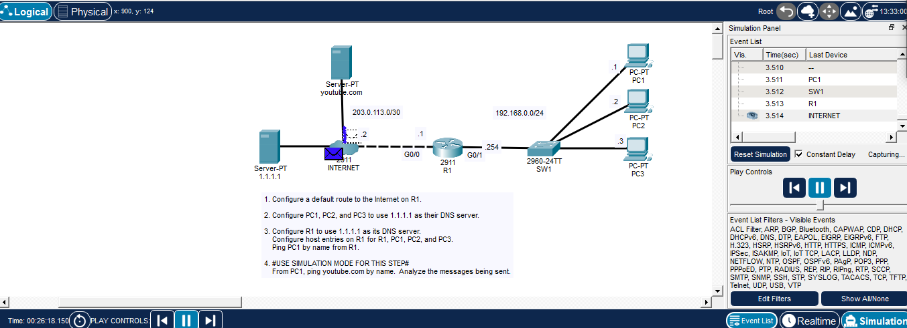
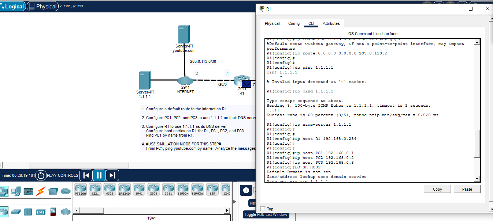
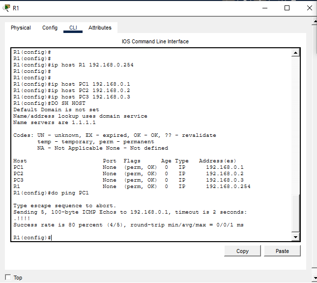
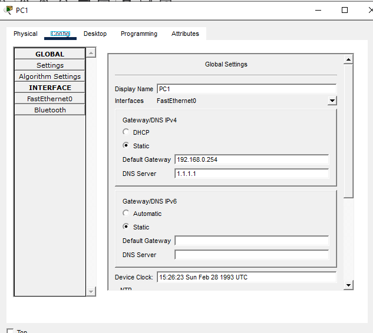
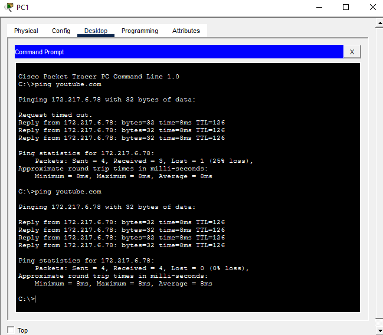

# CCNA DNS & Name Resolution Lab



A hands-on Cisco Packet Tracer lab focused on **DNS name resolution**, Cisco IOS hostname mappings, client DNS configuration, default routing, and verification using both router and PC command-line tools.

The lab demonstrates the difference between:

- Local hostname resolution on a Cisco router using `ip host`
- DNS-based name resolution using `ip name-server`
- End-device DNS configuration
- Name-to-IP resolution for an external destination
- Connectivity verification before and after DNS resolution

---

## Lab Objectives

The lab required the following tasks:

1. Configure a default route from R1 toward the Internet.
2. Configure PC1, PC2, and PC3 to use `1.1.1.1` as their DNS server.
3. Configure R1 to use `1.1.1.1` as its DNS server.
4. Configure static host entries on R1 for:
   - R1
   - PC1
   - PC2
   - PC3
5. Verify local hostname resolution by pinging PC1 by name from R1.
6. Use Packet Tracer Simulation Mode to observe DNS-related traffic.
7. From PC1, ping `youtube.com` by name and verify successful DNS resolution.

---

## Topology

```text
                    youtube.com
                        |
                   [ INTERNET ]
                   /          \
          DNS Server          R1
            1.1.1.1         G0/0
                              |
                        203.0.113.0/30
                              |
                           G0/1
                        192.168.0.254
                              |
                             SW1
                       /       |       \
                    PC1       PC2      PC3
                 192.168.0.1 .2       .3
```

---

## Addressing Plan

| Device | Interface / Role | IPv4 Address |
|---|---|---|
| R1 | LAN gateway | `192.168.0.254/24` |
| PC1 | LAN host | `192.168.0.1/24` |
| PC2 | LAN host | `192.168.0.2/24` |
| PC3 | LAN host | `192.168.0.3/24` |
| Internet Router | R1-facing transit | `203.0.113.2/30` |
| R1 | Internet-facing transit | `203.0.113.1/30` |
| DNS Server | DNS service | `1.1.1.1` |

### Client Settings

| Setting | Value |
|---|---|
| Default Gateway | `192.168.0.254` |
| DNS Server | `1.1.1.1` |

---

# 1. Configure the Default Route on R1

R1 requires a default route to reach destinations outside the local network.

```cisco
ip route 0.0.0.0 0.0.0.0 203.0.113.2
```

This sends traffic for unknown networks toward the Internet router.

### Connectivity Test

Before testing DNS, R1 was able to reach the DNS server:

```cisco
ping 1.1.1.1
```

Evidence:



---

# 2. Configure R1 to Use the DNS Server

R1 was configured to use `1.1.1.1` as its DNS server.

```cisco
ip name-server 1.1.1.1
```

This allows R1 to query the configured DNS server when resolving names that are not already present in its local host table.

---

# 3. Configure Static Host Entries on R1

The following local hostname mappings were configured:

```cisco
ip host R1 192.168.0.254
ip host PC1 192.168.0.1
ip host PC2 192.168.0.2
ip host PC3 192.168.0.3
```

These entries provide local hostname-to-IP mappings directly on R1.

---

## Verify the Host Table

The configured hostname mappings were verified with:

```cisco
show hosts
```

The host table contained:

```text
R1   -> 192.168.0.254
PC1  -> 192.168.0.1
PC2  -> 192.168.0.2
PC3  -> 192.168.0.3
```

Evidence:



---

# 4. Verify Local Name Resolution

R1 successfully resolved the locally configured hostname `PC1`.

```cisco
ping PC1
```

R1 translated `PC1` to:

```text
192.168.0.1
```

and successfully reached the device.

This demonstrates **local hostname resolution using `ip host`** rather than external DNS.

---

# 5. Configure DNS on PC1

PC1 was configured with:

```text
Default Gateway: 192.168.0.254
DNS Server:      1.1.1.1
```

Evidence:



PC2 and PC3 were configured to use the same DNS server.

---

# 6. Verify DNS Name Resolution from PC1

PC1 was used to test external name resolution:

```text
ping youtube.com
```

The hostname successfully resolved to:

```text
172.217.6.78
```

and ICMP replies were received.

Evidence:



A repeated ping completed with `0%` packet loss, confirming successful name resolution and end-to-end connectivity.

---

# 7. DNS Resolution Process

The name-resolution process can be summarized as:

```text
PC1
 |
 | User enters: ping youtube.com
 v
Check local name information
 |
 | Name is not locally known
 v
Send DNS query to 1.1.1.1
 |
 v
DNS Server
 |
 | Returns the IP address for youtube.com
 v
PC1 learns destination IP
 |
 v
PC1 sends ICMP Echo Request
 |
 v
R1 -> Internet -> Destination
 |
 v
ICMP Echo Reply returns to PC1
```

---

# 8. Packet Tracer Simulation Mode

Simulation Mode was used to observe traffic generated during the name-resolution process.


This allows inspection of the sequence of protocols involved before the final ICMP traffic reaches the destination.

Typical traffic observed during the process can include:

```text
ARP
DNS
ICMP
```

The important concept is that when a host is contacted by **name**, DNS resolution must occur before the host can send IP traffic to the resolved destination.

---

# Local Host Table vs DNS

| Method | Configuration | Resolution Source |
|---|---|---|
| Static hostname | `ip host PC1 192.168.0.1` | R1 local host table |
| DNS server | `ip name-server 1.1.1.1` | External DNS server |
| PC DNS | DNS field = `1.1.1.1` | External DNS server |

### Example

R1 resolving:

```text
PC1
```

uses the static `ip host` entry.

PC1 resolving:

```text
youtube.com
```

uses the configured DNS server.

---

# Key Commands Practiced

## Default Routing

```cisco
ip route 0.0.0.0 0.0.0.0 203.0.113.2
```

## Configure a DNS Server on Cisco IOS

```cisco
ip name-server 1.1.1.1
```

## Configure Local Hostname Mappings

```cisco
ip host R1 192.168.0.254
ip host PC1 192.168.0.1
ip host PC2 192.168.0.2
ip host PC3 192.168.0.3
```

## Verify Hostname Mappings

```cisco
show hosts
```

## Test Local Hostname Resolution

```cisco
ping PC1
```

## Test DNS Reachability

```cisco
ping 1.1.1.1
```

## Test DNS Resolution from a Client

```text
ping youtube.com
```

---

# Verification Evidence

## R1 Host Table


## R1 Route and DNS Configuration


## PC1 DNS Configuration


## Successful Name Resolution


---

# Troubleshooting Checklist

If DNS name resolution fails, verify:

- The client has a valid IPv4 address.
- The client has the correct default gateway.
- The DNS server address is configured correctly.
- The DNS server is reachable by IP.
- R1 has a valid route toward the DNS server.
- The default route points to the correct next hop.
- `ip name-server` is configured correctly on R1.
- `ip host` entries contain the correct hostname and IPv4 address.
- The hostname is typed correctly.
- IP connectivity works before troubleshooting DNS.
- `show hosts` contains the expected local entries.

A useful troubleshooting rule is:

```text
Can ping IP, but cannot ping name
        |
        v
Investigate name resolution / DNS
```

---

# Lab Results

| Requirement | Status |
|---|---|
| R1 default route | ✅ Passed |
| Reachability to DNS server | ✅ Passed |
| R1 DNS server configuration | ✅ Passed |
| R1 local host entries | ✅ Passed |
| `show hosts` verification | ✅ Passed |
| Ping PC1 by hostname | ✅ Passed |
| PC1 DNS configuration | ✅ Passed |
| PC2 DNS configuration | ✅ Configured |
| PC3 DNS configuration | ✅ Configured |
| External hostname resolution | ✅ Passed |
| `youtube.com` resolved to IPv4 | ✅ Passed |
| End-to-end ICMP test | ✅ Passed |
| Simulation Mode analysis | ✅ Completed |

---

# Skills Demonstrated

`Cisco IOS` · `DNS` · `IPv4` · `Static Routing` · `ip host` · `ip name-server` · `Packet Tracer` · `Network Troubleshooting` · `CCNA`

---

## Repository Structure

```text
ccna-dns-name-resolution-lab/
├── README.md
└── images/
    ├── 01-dns-lab-topology-simulation.png
    ├── 02-r1-host-table-verification.png
    ├── 03-r1-default-route-and-dns-config.png
    ├── 04-pc1-dns-name-resolution-test.png
    └── 05-pc1-gateway-and-dns-settings.png
```

---

## Learning Source

Lab concepts based on **Jeremy's IT Lab** DNS lesson and Cisco CCNA networking fundamentals.

---

## Repository Purpose

This repository is part of my hands-on CCNA lab portfolio.

The goal is to document practical experience configuring, verifying, and troubleshooting network services using Cisco IOS and Cisco Packet Tracer instead of studying the concepts only theoretically.
