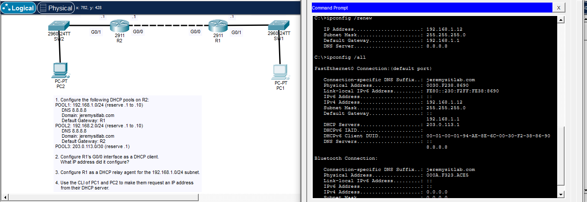
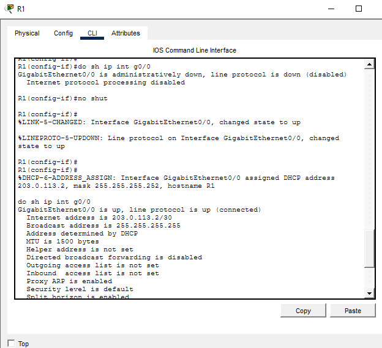
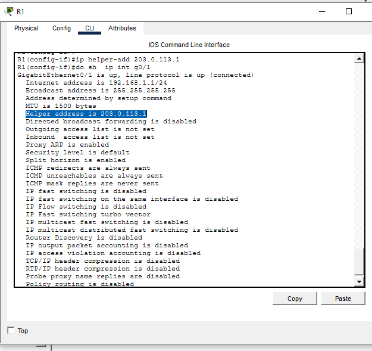
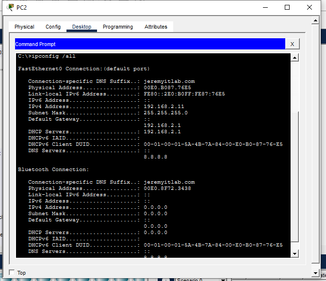
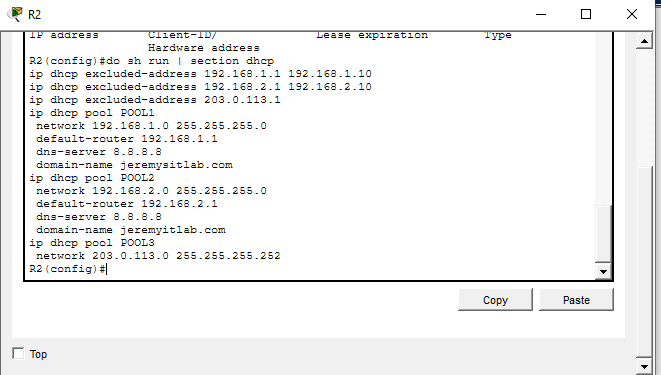
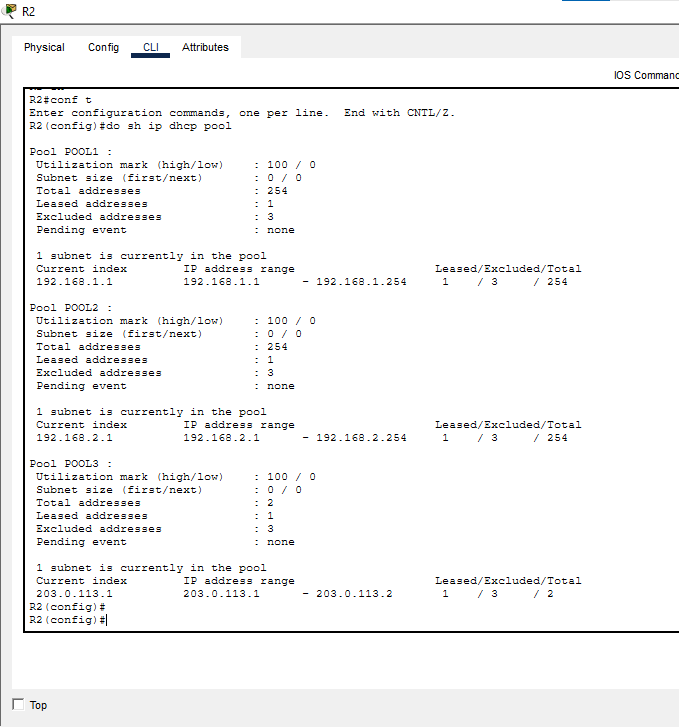

# CCNA DHCP Server, Client & Relay Lab



A hands-on Cisco Packet Tracer lab demonstrating the main DHCP roles covered in CCNA study:

- DHCP server
- DHCP client
- DHCP relay agent
- DHCP address exclusions
- DHCP options
- Lease and pool verification

## Lab Overview

R2 operates as the centralized DHCP server and provides three DHCP pools.

R1 performs two DHCP roles:

- `G0/0` acts as a DHCP client and receives an address from R2.
- `G0/1` acts as a DHCP relay agent for the `192.168.1.0/24` LAN.

PC1 receives its configuration through the DHCP relay, while PC2 receives its configuration directly from R2.

## Topology

```text
192.168.2.0/24                              192.168.1.0/24

     PC2                                          PC1
      |                                            |
     SW2                                          SW1
      |                                            |
      | G0/1                                  G0/1 |
      |                                            |
     R2 ----------------- R1
          203.0.113.0/30
           G0/0   G0/0

 DHCP Server            DHCP Client
                        DHCP Relay
```

## Addressing Plan

| Network | Purpose | Gateway / Router |
|---|---|---|
| `192.168.1.0/24` | PC1 LAN | `192.168.1.1` |
| `192.168.2.0/24` | PC2 LAN | `192.168.2.1` |
| `203.0.113.0/30` | R1-R2 transit | R2 = `203.0.113.1` |

DHCP options used:

| Option | Value |
|---|---|
| DNS server | `8.8.8.8` |
| Domain name | `jeremysitlab.com` |

## R2 — DHCP Server Configuration

### Excluded addresses

```cisco
ip dhcp excluded-address 192.168.1.1 192.168.1.10
ip dhcp excluded-address 192.168.2.1 192.168.2.10
ip dhcp excluded-address 203.0.113.1
```

### POOL1 — 192.168.1.0/24

```cisco
ip dhcp pool POOL1
 network 192.168.1.0 255.255.255.0
 default-router 192.168.1.1
 dns-server 8.8.8.8
 domain-name jeremysitlab.com
```

### POOL2 — 192.168.2.0/24

```cisco
ip dhcp pool POOL2
 network 192.168.2.0 255.255.255.0
 default-router 192.168.2.1
 dns-server 8.8.8.8
 domain-name jeremysitlab.com
```

### POOL3 — 203.0.113.0/30

```cisco
ip dhcp pool POOL3
 network 203.0.113.0 255.255.255.252
```

## R1 — DHCP Client

R1's `G0/0` interface was configured to obtain its IPv4 address dynamically.

```cisco
interface g0/0
 ip address dhcp
 no shutdown
```

R1 successfully received:

```text
203.0.113.2/30
```

Evidence:



## R1 — DHCP Relay Agent

R1 forwards DHCP traffic from the PC1 LAN to the DHCP server on R2.

```cisco
interface g0/1
 ip helper-address 203.0.113.1
```

Evidence:



## DHCP Flow

```text
PC1
 |
 | DHCPDISCOVER broadcast
 v
R1 G0/1
 |
 | ip helper-address 203.0.113.1
 v
R2 DHCP Server
 |
 v
POOL1
 |
 v
PC1 receives 192.168.1.x/24
```

## Client Verification

### PC1 — DHCP through relay

PC1 successfully obtained a valid lease from the remote DHCP server.


### PC2 — Direct DHCP

PC2 successfully obtained:

```text
IPv4 Address      : 192.168.2.11
Subnet Mask       : 255.255.255.0
Default Gateway   : 192.168.2.1
DHCP Server       : 192.168.2.1
DNS Server        : 8.8.8.8
DNS Suffix        : jeremysitlab.com
```

Evidence:



## DHCP Server Configuration Evidence

The following screenshot shows the DHCP exclusions and pools configured on R2.



## DHCP Pool Verification

Verification command:

```cisco
show ip dhcp pool
```

All three pools showed active leases.



Additional useful verification:

```cisco
show ip dhcp binding
show ip dhcp pool
show ip interface g0/0
show ip interface g0/1
```

Client-side commands:

```text
ipconfig /release
ipconfig /renew
ipconfig /all
```

## Key Concepts Practiced

- Configuring a Cisco IOS DHCP server
- Creating multiple DHCP pools
- Reserving addresses with `ip dhcp excluded-address`
- Supplying default gateway, DNS, and domain-name options
- Configuring a Cisco IOS interface as a DHCP client
- Relaying DHCP broadcasts with `ip helper-address`
- Verifying leases and DHCP pools
- Troubleshooting DHCP from both router and client perspectives

## Commands Practiced

```cisco
ip dhcp excluded-address
ip dhcp pool
 network
 default-router
 dns-server
 domain-name

interface g0/0
 ip address dhcp

interface g0/1
 ip helper-address

show ip dhcp pool
show ip dhcp binding
show ip interface
```

## Troubleshooting Checklist

When a DHCP client fails to receive an address, verify:

- The client is configured for DHCP.
- The DHCP pool uses the correct network and mask.
- The default-router value is correct.
- Reserved addresses are correctly excluded.
- The DHCP server is reachable.
- `ip helper-address` is configured on the client-facing router interface.
- The helper address points to the correct DHCP server.
- Router interfaces are up/up.
- `show ip dhcp pool` shows the expected subnet.
- `show ip dhcp binding` shows the expected lease.

## Lab Result

| Feature | Status |
|---|---|
| R2 DHCP server | ✅ Passed |
| POOL1 | ✅ Passed |
| POOL2 | ✅ Passed |
| POOL3 | ✅ Passed |
| DHCP exclusions | ✅ Passed |
| DNS option | ✅ Passed |
| Domain-name option | ✅ Passed |
| R1 DHCP client | ✅ Passed |
| R1 DHCP relay | ✅ Passed |
| PC1 DHCP | ✅ Passed |
| PC2 DHCP | ✅ Passed |
| DHCP pool verification | ✅ Passed |

**Final result: Successfully completed — 10/10.**

## Repository Structure

```text
ccna-dhcp-server-client-relay/
├── README.md
├── images/
│   ├── 01-topology-and-pc1-verification.png
│   ├── 02-pc2-dhcp-ipconfig.png
│   ├── 03-r2-dhcp-server-configuration.png
│   ├── 04-r1-dhcp-client-verification.png
│   ├── 05-r1-dhcp-relay-verification.png
│   └── 06-r2-dhcp-pool-verification.png
└── lab/
    └── PLACE_PACKET_TRACER_FILE_HERE.txt
```

## Skills Demonstrated

`Cisco IOS` · `DHCP` · `DHCP Relay` · `IPv4` · `Cisco Packet Tracer` · `Network Services` · `Troubleshooting` · `CCNA`

## Learning Source

Lab concepts based on Jeremy's IT Lab DHCP lesson and Cisco CCNA networking fundamentals.

## Repository Purpose

This repository is part of a hands-on CCNA lab portfolio and documents practical Cisco configuration, verification, and troubleshooting work.
