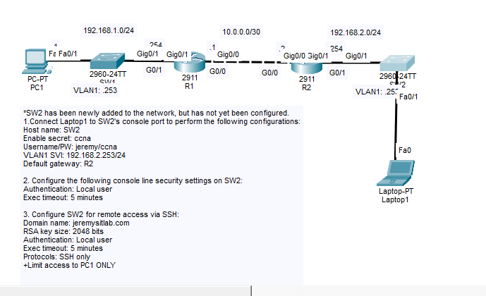
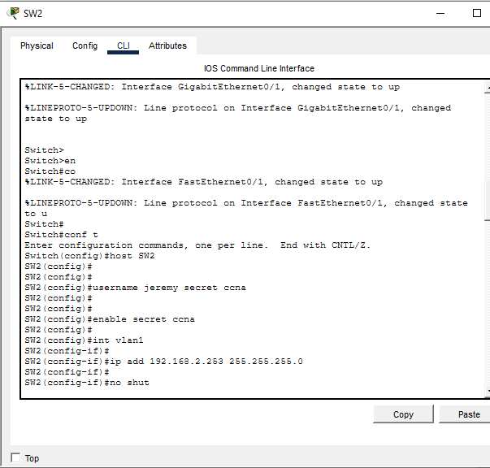
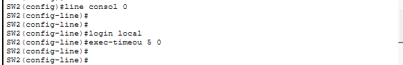
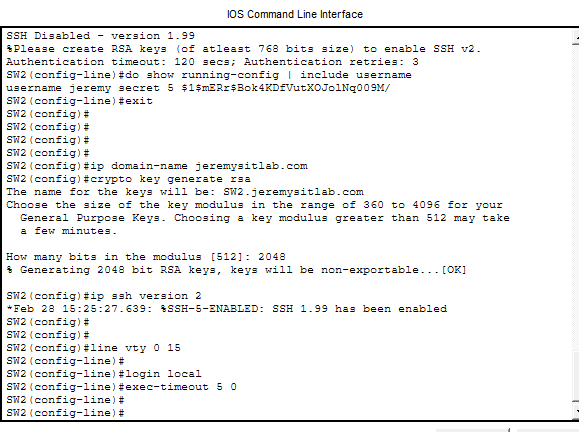

# SSH Remote Access Security Lab

Cisco Packet Tracer lab focused on securing local console access and remote SSH management on a Cisco Layer 2 switch.

## Lab Objectives

- Configure SW2 with a management IP address.
- Configure a default gateway for remote management.
- Secure physical console access with the local user database.
- Enable SSH version 2 using RSA keys.
- Restrict VTY access to SSH only.
- Allow remote SSH access only from PC1 using an ACL.
- Verify console, SSH, VTY, and ACL configuration.

## Topology



### Key Addressing

| Device | Interface / Purpose | Address |
|---|---|---|
| PC1 | Authorized SSH client | `192.168.1.1` |
| SW2 | VLAN 1 management SVI | `192.168.2.253/24` |
| R2 | SW2 default gateway | `192.168.2.254` |

## SW2 Base Configuration

The switch was prepared with a hostname, local user, enable secret, and VLAN 1 management address.



Example configuration:

```cisco
hostname SW2
username jeremy secret ccna
enable secret ccna

interface vlan 1
 ip address 192.168.2.253 255.255.255.0
 no shutdown

ip default-gateway 192.168.2.254
```

> The credentials shown here are training-only credentials used inside the Packet Tracer lab.

## Console Security

Physical console access uses the switch's local username/password database and disconnects idle sessions after five minutes.

```cisco
line console 0
 login local
 exec-timeout 5 0
```



## SSH Configuration

SSH was enabled using a domain name, 2048-bit RSA key, and SSH version 2.

```cisco
ip domain-name jeremysitlab.com
crypto key generate rsa
ip ssh version 2
```

RSA modulus used in the lab:

```text
2048 bits
```



## VTY Remote Access Security

All VTY lines use local authentication, a five-minute inactivity timeout, and accept SSH only.

```cisco
line vty 0 15
 login local
 exec-timeout 5 0
 transport input ssh
 access-class 1 in
```

## ACL Restriction

Only PC1 is permitted to initiate remote management access to SW2.

```cisco
access-list 1 permit host 192.168.1.1
```

Because a standard ACL has an implicit deny at the end, all other source addresses are denied from accessing the VTY lines.

## Verification

Useful verification commands used in the lab:

```cisco
show ip interface brief
show ip ssh
show access-lists
show running-config | section line con
show running-config | section line vty
show running-config | include username
show running-config | include default-gateway
```

Expected behavior:

- PC1 can SSH to `192.168.2.253`.
- Other hosts cannot open an SSH session to SW2.
- Telnet is rejected because the VTY lines allow SSH only.
- Console access authenticates against the local user database.
- Idle console and VTY sessions time out after five minutes.

## Skills Practiced

- Cisco IOS CLI navigation
- Switch management SVI configuration
- Local authentication
- Console line security
- VTY line security
- RSA key generation
- SSHv2 configuration
- Standard ACLs
- `access-class` for management-plane filtering
- Configuration verification and troubleshooting

## Lab Files

```text
30-Lab-SSH/
├── README.md
├── 30-Lab-SSH.pkt
└── screenshots/
    ├── topology.png
    ├── sw2-base-config.png
    ├── console-security.png
    └── ssh-rsa-vty-config.png
```

## Result

The lab demonstrates a basic secure-management design: physical console access is protected with local authentication, remote management is encrypted with SSHv2, and VTY access is limited to an explicitly authorized management host.
