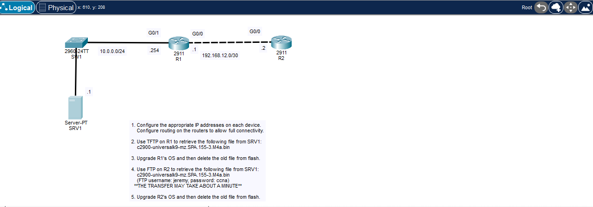
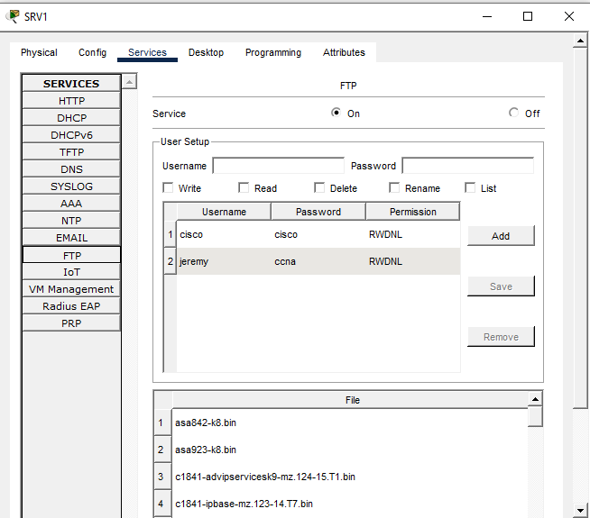
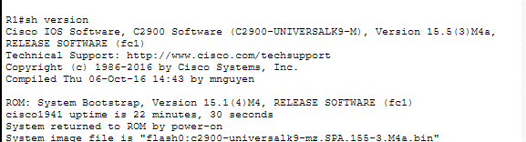
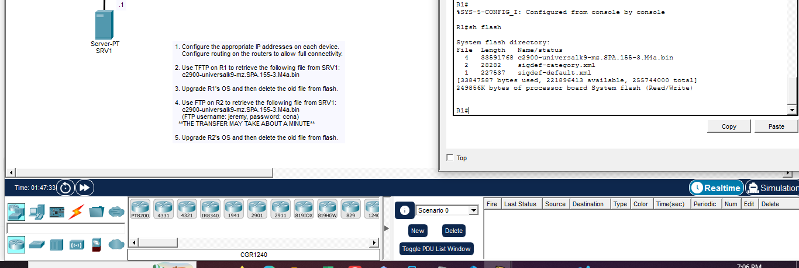
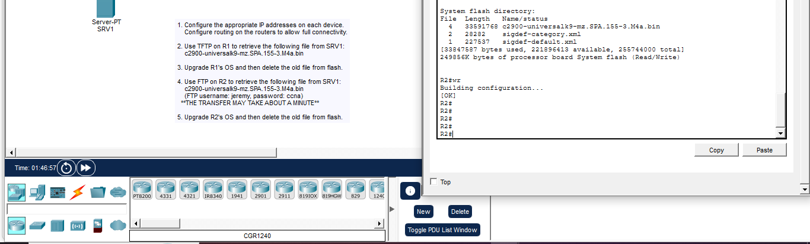

# CCNA FTP/TFTP IOS Image Upgrade Lab

Cisco Packet Tracer lab focused on **IOS file management, TFTP, FTP, boot configuration, routing, and upgrade verification**.

The goal was to copy a newer Cisco IOS image from a server to two routers using two different transfer protocols:

- **R1:** TFTP
- **R2:** FTP with username/password authentication

Both routers were then configured to boot the new IOS image, reloaded, verified, and the old IOS image was removed from flash.

---

## Lab Topology



### Addressing

| Device | Interface | IP address | Mask | Purpose |
|---|---|---:|---:|---|
| SRV1 | NIC | `10.0.0.1` | `/24` | TFTP/FTP server |
| R1 | G0/1 | `10.0.0.254` | `/24` | Server LAN gateway |
| R1 | G0/0 | `192.168.12.1` | `/30` | R1-R2 link |
| R2 | G0/0 | `192.168.12.2` | `/30` | R1-R2 link |

SRV1 default gateway: `10.0.0.254`

---

## Lab Objectives

1. Configure the required IP addresses.
2. Configure routing so all devices have connectivity.
3. Use **TFTP on R1** to retrieve:
   `c2900-universalk9-mz.SPA.155-3.M4a.bin`
4. Upgrade R1 to the new IOS image.
5. Use **FTP on R2** to retrieve the same IOS image.
6. Authenticate to FTP with:
   - Username: `jeremy`
   - Password: `ccna`
7. Upgrade R2 to the new IOS image.
8. Verify both routers are running IOS **15.5(3)M4a**.
9. Delete the old IOS image from flash.

---

## 1. Configure IP Addressing

### R1

```cisco
configure terminal
interface g0/1
 ip address 10.0.0.254 255.255.255.0
 no shutdown
exit

interface g0/0
 ip address 192.168.12.1 255.255.255.252
 no shutdown
end
```

### R2

```cisco
configure terminal
interface g0/0
 ip address 192.168.12.2 255.255.255.252
 no shutdown
exit

ip route 10.0.0.0 255.255.255.0 192.168.12.1
end
```

### Basic verification

```cisco
show ip interface brief
show ip route
ping 10.0.0.1
```

R2 needs a route toward the `10.0.0.0/24` server network through R1.

---

## 2. Verify the Server Services

SRV1 provides both TFTP and FTP services. The FTP service contains the user account required by the lab.



FTP credentials used by R2:

```text
Username: jeremy
Password: ccna
```

### Protocol difference

- **TFTP** is simple and does not use username/password authentication.
- **FTP** supports authentication, so IOS can be configured with an FTP username and password.

---

## 3. R1 — Copy the IOS Image with TFTP

First verify connectivity and flash storage:

```cisco
ping 10.0.0.1
show flash
```

Copy the image from SRV1:

```cisco
copy tftp: flash0:
```

Packet Tracer prompts for the server and filename:

```text
Address or name of remote host []? 10.0.0.1
Source filename []? c2900-universalk9-mz.SPA.155-3.M4a.bin
Destination filename [c2900-universalk9-mz.SPA.155-3.M4a.bin]?
```

Verify the new image exists:

```cisco
show flash
```

---

## 4. R1 — Configure the New Boot Image

Configure the router to use the new IOS image at the next boot:

```cisco
configure terminal
boot system flash0:c2900-universalk9-mz.SPA.155-3.M4a.bin
end
```

If an old `boot system` statement already exists, remove that specific statement first.

Verify the boot configuration:

```cisco
show running-config | include boot
```

Save the configuration:

```cisco
copy running-config startup-config
```

Then reload the router:

```cisco
reload
```

> **Important:** `show version` displays the IOS image that is running **right now**. It will continue to show the old IOS until the router is reloaded and actually boots the new image.

After the reload:

```cisco
show version
```

R1 successfully booted IOS **15.5(3)M4a**:



Expected result:

```text
Cisco IOS Software ... Version 15.5(3)M4a
System image file is "flash0:c2900-universalk9-mz.SPA.155-3.M4a.bin"
```

---

## 5. R2 — Configure FTP Authentication

Unlike TFTP, FTP requires the credentials provided by the lab.

```cisco
configure terminal
ip ftp username jeremy
ip ftp password ccna
end
```

Verify reachability to the server:

```cisco
ping 10.0.0.1
```

---

## 6. R2 — Copy the IOS Image with FTP

```cisco
copy ftp: flash0:
```

Use:

```text
FTP server: 10.0.0.1
Source filename: c2900-universalk9-mz.SPA.155-3.M4a.bin
```

After the transfer completes:

```cisco
show flash
```

The transfer can take approximately one minute in this Packet Tracer activity.

---

## 7. R2 — Configure the New Boot Image

```cisco
configure terminal
boot system flash0:c2900-universalk9-mz.SPA.155-3.M4a.bin
end
```

Verify the boot statement:

```cisco
show running-config | include boot
```

Save it:

```cisco
copy running-config startup-config
```

Reload:

```cisco
reload
```

Then verify the running IOS:

```cisco
show version
```

Final R2 result:

```text
Cisco IOS Software ... Version 15.5(3)M4a
System image file is "flash0:c2900-universalk9-mz.SPA.155-3.M4a.bin"
```

This confirms that R2 successfully booted the upgraded IOS image.

---

## 8. Delete the Old IOS Image

After confirming the router has successfully booted the new IOS, inspect flash:

```cisco
show flash
```

Then delete the old image using its exact filename, for example:

```cisco
delete flash0:c2900-universalk9-mz.SPA.151-1.M4.bin
```

Verify again:

```cisco
show flash
```

### R1 Flash Verification



### R2 Flash Verification



The screenshots show the new IOS image present in flash and the old IOS image removed.

---

## Useful IOS Commands from the Lab

```cisco
show file systems
show version
show flash
copy source destination
boot system filepath
ip ftp username username
ip ftp password password
show running-config | include boot
copy running-config startup-config
reload
```

### What each command is for

| Command | Purpose |
|---|---|
| `show file systems` | Displays available IOS file systems and prefixes |
| `show version` | Shows the IOS version currently running and the system image used at boot |
| `show flash` | Displays files and free space in flash memory |
| `copy source destination` | Copies files between locations/protocols |
| `boot system filepath` | Defines the IOS image to load during the next boot |
| `ip ftp username` | Configures the FTP username used by IOS |
| `ip ftp password` | Configures the FTP password used by IOS |
| `show run \| include boot` | Verifies configured boot statements |
| `copy run start` | Saves the configuration for the next reboot |
| `reload` | Reboots the router so the selected IOS image can load |

---

## Verification Checklist

- [x] SRV1 configured as `10.0.0.1/24`
- [x] R1 server-facing interface configured as `10.0.0.254/24`
- [x] R1-R2 link configured as `192.168.12.0/30`
- [x] R2 can reach SRV1
- [x] New IOS transferred to R1 with TFTP
- [x] New IOS transferred to R2 with FTP
- [x] FTP authentication configured on R2
- [x] New `boot system` image configured
- [x] Configuration saved before reboot
- [x] Routers reloaded
- [x] `show version` confirms IOS 15.5(3)M4a
- [x] Old IOS image deleted from flash

---

## Key Lesson

The most important upgrade sequence from this lab is:

```text
Verify connectivity
      ↓
Check flash space
      ↓
Copy the new IOS image
      ↓
Verify the image is in flash
      ↓
Configure boot system
      ↓
Verify the boot statement
      ↓
Save running-config to startup-config
      ↓
Reload
      ↓
Verify with show version
      ↓
Delete the old IOS image
```

A critical detail is that configuring `boot system` does **not** immediately change the running IOS. The router must be **reloaded** before `show version` can confirm that the new image is actually running.

---

## Skills Practiced

- Cisco IOS file-system navigation
- TFTP file transfer
- FTP file transfer and authentication
- IOS image management
- Boot system configuration
- Static routing
- Connectivity verification
- Flash memory verification
- IOS upgrade verification
- Safe removal of an old IOS image

---

## Lab Status

**Completed successfully.** Both R1 and R2 were upgraded to:

```text
c2900-universalk9-mz.SPA.155-3.M4a.bin
```

and verified running **Cisco IOS 15.5(3)M4a**.
