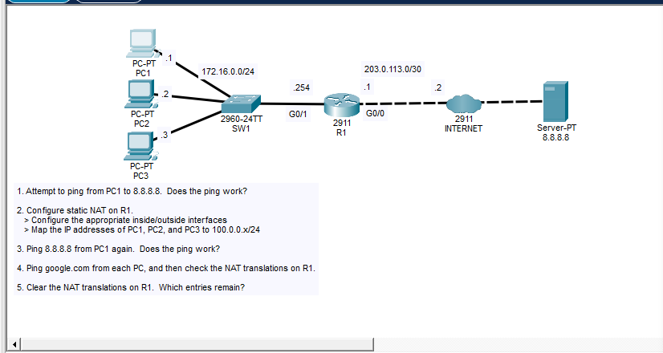
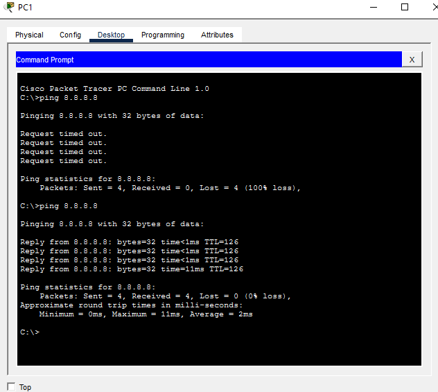
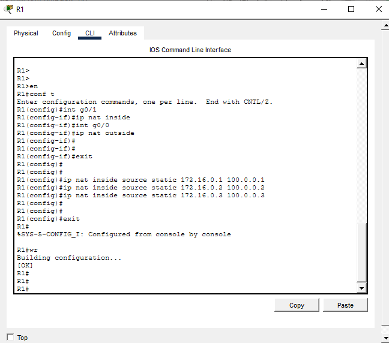
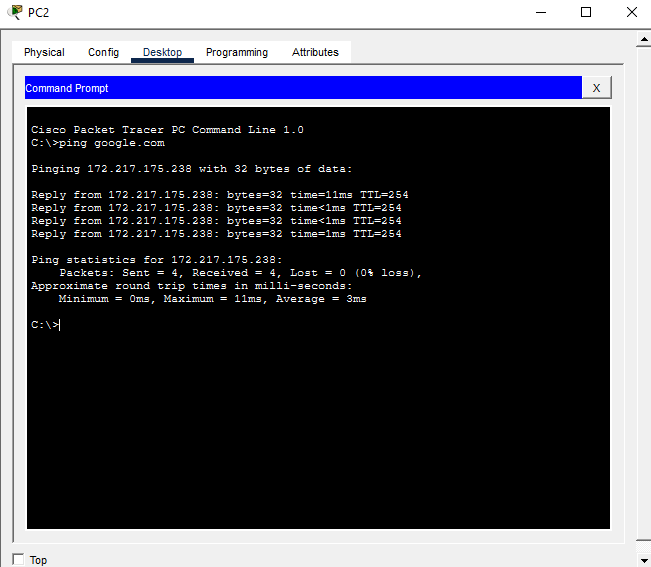
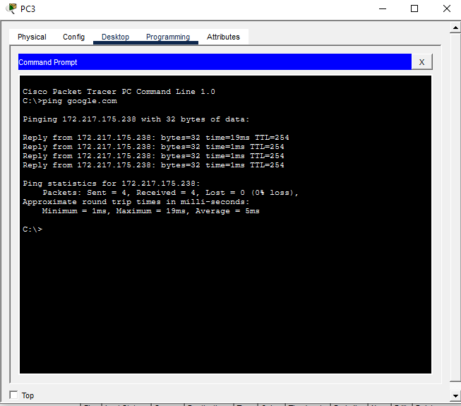
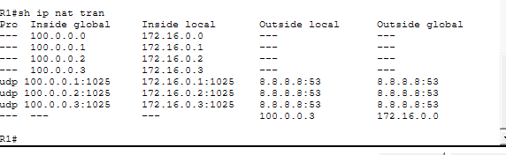
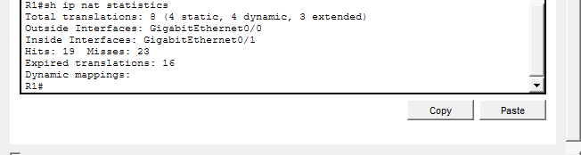
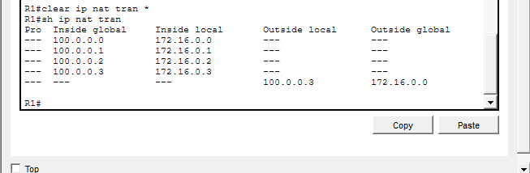

# Cisco CCNA Static NAT Configuration Lab

This lab demonstrates how to configure and verify **Static NAT (Network Address Translation)** on a Cisco router in **Cisco Packet Tracer**.

The goal is to allow three inside hosts using private IPv4 addresses to reach an outside network by assigning each host a permanent one-to-one public/global address.

---

## Lab Topology



### Addressing used

| Device | Interface / Host | IPv4 Address | Role |
|---|---|---:|---|
| PC1 | NIC | `172.16.0.1/24` | Inside host |
| PC2 | NIC | `172.16.0.2/24` | Inside host |
| PC3 | NIC | `172.16.0.3/24` | Inside host |
| R1 | G0/1 | `172.16.0.254/24` | NAT inside |
| R1 | G0/0 | `203.0.113.1/30` | NAT outside |
| Internet Router | WAN | `203.0.113.2/30` | Outside network |
| Server | Server | `8.8.8.8` | External test host |

### Static NAT mappings

| Inside Local | Inside Global |
|---|---|
| `172.16.0.1` | `100.0.0.1` |
| `172.16.0.2` | `100.0.0.2` |
| `172.16.0.3` | `100.0.0.3` |

---

## Objectives

- Confirm that the inside hosts cannot reach the external server before NAT is configured.
- Identify the router's inside and outside NAT interfaces.
- Configure three permanent Static NAT mappings.
- Verify external connectivity after NAT is enabled.
- Inspect the NAT translation table and NAT statistics.
- Clear NAT translations and observe which entries remain.

---

## 1. Verify Connectivity Before NAT

Before configuring NAT, PC1 attempted to reach `8.8.8.8` and the ping failed.

This confirms that the private inside address is not usable directly on the outside network.



---

## 2. Configure NAT Inside and Outside Interfaces

On R1, the LAN-facing interface is configured as the NAT inside interface and the WAN-facing interface is configured as the NAT outside interface.

```text
R1# configure terminal

R1(config)# interface g0/1
R1(config-if)# ip nat inside
R1(config-if)# exit

R1(config)# interface g0/0
R1(config-if)# ip nat outside
R1(config-if)# exit
```

---

## 3. Configure Static NAT Mappings

Each private inside address is permanently mapped to one inside-global address.

```text
R1(config)# ip nat inside source static 172.16.0.1 100.0.0.1
R1(config)# ip nat inside source static 172.16.0.2 100.0.0.2
R1(config)# ip nat inside source static 172.16.0.3 100.0.0.3
```



The configuration is then saved:

```text
R1# write
```

---

## 4. Test Connectivity After NAT

After Static NAT is configured, PC1 can successfully reach `8.8.8.8`.

The first test failed before NAT. The second test succeeded after NAT was configured.


The other inside hosts can also reach the external network and resolve `google.com` successfully.

### PC2 connectivity test



### PC3 connectivity test



---

## 5. Verify the NAT Translation Table

Use the following command on R1:

```text
R1# show ip nat translations
```



The important mappings are:

```text
Inside Global    Inside Local
100.0.0.1        172.16.0.1
100.0.0.2        172.16.0.2
100.0.0.3        172.16.0.3
```

The UDP entries in the output show active translated traffic. Port `53` indicates DNS queries generated when the PCs resolve `google.com`.

Example:

```text
udp 100.0.0.1:1025 172.16.0.1:1025 8.8.8.8:53 8.8.8.8:53
```

This demonstrates the difference between the permanent static mapping and temporary protocol-specific translation entries created while traffic is active.

---

## 6. Verify NAT Statistics

Use:

```text
R1# show ip nat statistics
```



This command is useful for checking:

- Total translations
- Static and dynamic translation counts
- Inside and outside interfaces
- NAT hits and misses
- Expired translations

---

## 7. Clear NAT Translations

To clear active dynamic translations:

```text
R1# clear ip nat translation *
```

Then verify again:

```text
R1# show ip nat translations
```



The temporary dynamic/extended entries disappear, while the configured Static NAT mappings remain.

This is expected because Static NAT entries are part of the router configuration and are not removed by clearing the translation table.

---

## Useful Verification Commands

```text
show ip nat translations
show ip nat statistics
show running-config | include ip nat
show running-config interface g0/0
show running-config interface g0/1
clear ip nat translation *
```

---

## Static NAT Traffic Flow

For traffic originating from PC1:

```text
PC1
172.16.0.1
   |
   | Inside Local
   v
R1 NAT
172.16.0.1  --->  100.0.0.1
                      |
                      | Inside Global
                      v
                  Internet
                      |
                      v
                   8.8.8.8
```

R1 replaces the source address `172.16.0.1` with `100.0.0.1` when the packet leaves the inside network.

Return traffic addressed to `100.0.0.1` is translated back to `172.16.0.1` and forwarded to PC1.

---

## Key CCNA Takeaways

- **Inside Local** = the real private address of the inside host.
- **Inside Global** = the address used to represent the inside host to the outside network.
- Static NAT creates a **permanent one-to-one mapping**.
- `ip nat inside` identifies the interface facing the private network.
- `ip nat outside` identifies the interface facing the public/outside network.
- `show ip nat translations` displays the translation table.
- `show ip nat statistics` displays NAT counters and interface roles.
- `clear ip nat translation *` removes temporary translations but does not remove configured static mappings.

---

## Configuration Summary

```text
interface GigabitEthernet0/1
 ip nat inside
!
interface GigabitEthernet0/0
 ip nat outside
!
ip nat inside source static 172.16.0.1 100.0.0.1
ip nat inside source static 172.16.0.2 100.0.0.2
ip nat inside source static 172.16.0.3 100.0.0.3
```

---

## Result

**Static NAT configuration successful.**

All three inside hosts can access the outside network using their assigned permanent inside-global addresses, and the translations can be verified directly from R1.

> Lab note: before publishing the final Packet Tracer file, verify `show running-config | include ip nat` and make sure only the three intended host mappings (`.1`, `.2`, `.3`) are configured.

---

**Topics:** `CCNA` · `Cisco` · `Packet Tracer` · `NAT` · `Static NAT` · `IPv4` · `Network Engineering`
