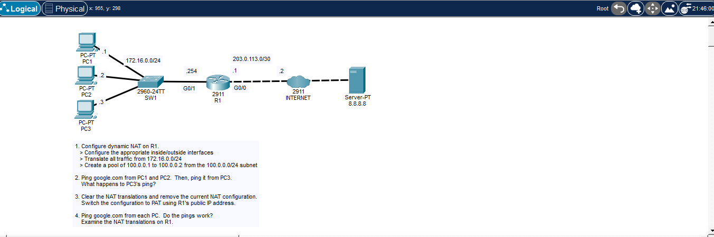
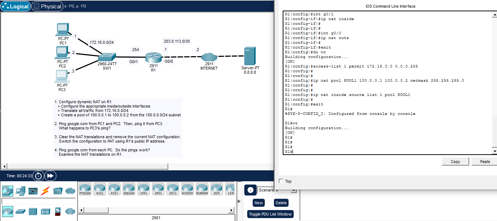
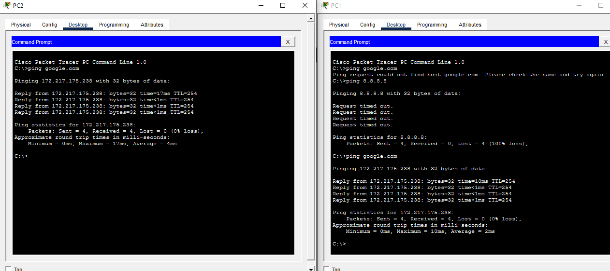
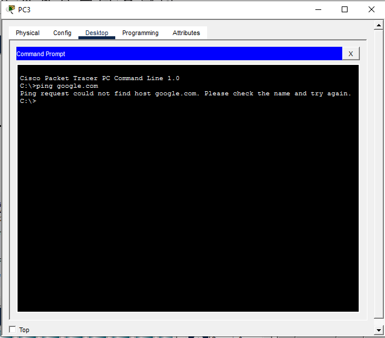
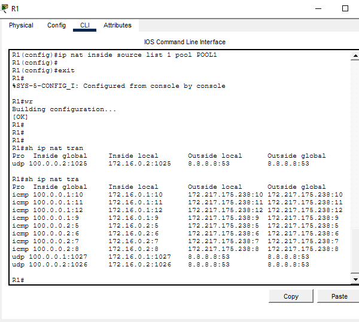
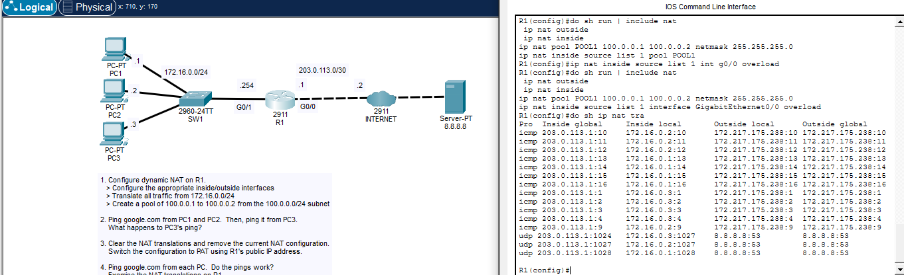
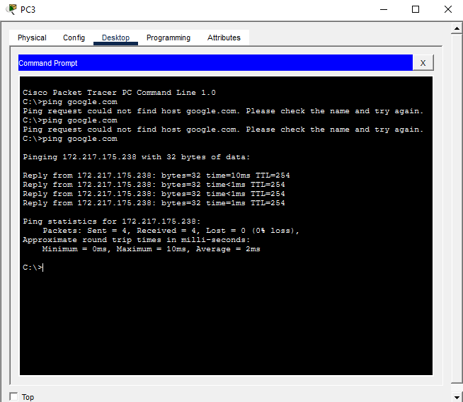

# Dynamic NAT & PAT Lab

Small lab on R1 (2911) with 3 PCs behind it (172.16.0.0/24), a switch, and a simulated internet leading to a server at 8.8.8.8 (google.com). R1's outside link sits on 203.0.113.0/30.



## What I did

First set up dynamic NAT on R1: marked G0/1 as inside, G0/0 as outside, wrote an ACL to match 172.16.0.0/24, and built a pool (POOL1) with only two public addresses — 100.0.0.1 and 100.0.0.2.

```
interface GigabitEthernet0/1
 ip nat inside
interface GigabitEthernet0/0
 ip nat outside
exit
access-list 1 permit 172.16.0.0 0.0.0.255
ip nat pool POOL1 100.0.0.1 100.0.0.2 netmask 255.255.255.0
ip nat inside source list 1 pool POOL1
```



Pinged google.com from PC1 and PC2 — both worked fine, each grabbed one of the two pool addresses.



Then tried from PC3 and it failed right away, couldn't even resolve the name.



Made sense once I checked the NAT table — the pool only had 2 addresses and PC1/PC2 had already taken both, so PC3 had nowhere to go.



Next step was to switch to PAT using R1's own public IP instead of the pool:

```
ip nat inside source list 1 interface GigabitEthernet0/0 overload
```

(Didn't bother removing the old `ip nat pool POOL1` line since it's harmless once it's not being referenced anymore — just leftover in the config, would clean it up with `no ip nat pool POOL1` for a tidier setup.)



Re-tested pings from all 3 PCs and this time everyone got through, including PC3.



Checked `sh ip nat translations` and saw all three hosts sharing the same outside address (203.0.113.1, R1's own interface), just split apart by port number.

## Takeaway

Dynamic NAT is basically a 1-to-1 swap — you're limited by how many public addresses you put in the pool, so it runs out fast with more hosts than addresses. PAT gets around that by reusing one IP for everyone and telling connections apart by port instead, which is why pretty much every router at home or in a small office runs PAT rather than a real pool.
