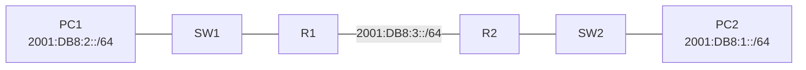

# Lab 02 — IPv6 Static Routing and Troubleshooting

## Overview

In this Packet Tracer lab, I built a small routed IPv6 network with two LANs connected through R1 and R2. I configured IPv6 addressing, enabled IPv6 forwarding, added static routes, configured host default gateways, verified end-to-end connectivity, and troubleshot two real configuration mistakes that prevented the network from working.

The final result was successful IPv6 communication between the two PCs with **0% packet loss**.

## Skills practiced

- IPv6 global unicast addressing
- `/64` IPv6 LAN and transit prefixes
- Automatically generated link-local addresses
- `ipv6 unicast-routing`
- IPv6 static routing
- Global-unicast next-hop static routes
- Link-local next-hop static routes
- IPv6 default gateways on hosts
- Connected, local, and static route interpretation
- `show ipv6 interface brief`
- `show ipv6 route`
- IPv6 ping testing
- Troubleshooting overlapping prefixes
- Troubleshooting an incorrect link-local next hop

---

## Topology




Traffic path:

```text
PC1 → SW1 → R1 → R2 → SW2 → PC2
```

---

## IPv6 addressing plan

### Router interfaces

| Device | Interface | Global IPv6 address | Link-local address | Purpose |
|---|---|---|---|---|
| R1 | G0/0 | `2001:DB8:3::1/64` | `FE80::201:63FF:FE26:7D01` | Transit link to R2 |
| R1 | G0/1 | `2001:DB8:2::1/64` | `FE80::201:63FF:FE26:7D02` | PC1 LAN gateway |
| R2 | G0/0 | `2001:DB8:3::2/64` | `FE80::202:16FF:FE7D:1B01` | Transit link to R1 |
| R2 | G0/1 | `2001:DB8:1::2/64` | `FE80::202:16FF:FE7D:1B02` | PC2 LAN gateway |

The three routed links use three different `/64` networks:

```text
PC1 LAN:      2001:DB8:2::/64
R1–R2 link:   2001:DB8:3::/64
PC2 LAN:      2001:DB8:1::/64
```

This reinforced an important IPv6 rule:

> Different routed links should use different IPv6 prefixes. Devices on the same link must share the same prefix.

### PC1

| Setting | Value |
|---|---|
| IPv6 address | `2001:DB8:2::3/64` |
| Default gateway | `2001:DB8:2::1` |


---

## Step 1 — Enable IPv6 routing

IPv6 forwarding was enabled on both routers:

```cisco
ipv6 unicast-routing
```

Verification:

```cisco
show running-config | include ipv6 unicast-routing
```

Without this command, the router can have IPv6 addresses but will not route IPv6 traffic between interfaces.

---

## Step 2 — Configure the router interfaces

Each routed segment received its own `/64` prefix.

Example verification on R1:


Useful command:

```cisco
show ipv6 interface brief
```

The output verifies:

- interface state
- global unicast address
- automatically generated link-local address

---

## Step 3 — Configure IPv6 static routes

The lab uses two different static-route styles.

### R1 — link-local next hop

R1 reaches the remote `2001:DB8:1::/64` LAN through R2.

```cisco
ipv6 route 2001:DB8:1::/64 GigabitEthernet0/0 FE80::202:16FF:FE7D:1B01
```

When a **link-local address** is used as the next hop, the exit interface must also be specified because link-local addresses are only significant on the local link.

### R2 — global-unicast next hop

R2 reaches the remote `2001:DB8:2::/64` LAN through R1.

```cisco
ipv6 route 2001:DB8:2::/64 2001:DB8:3::1
```

A global-unicast next hop does not require the exit interface in this case.

### Route verification

```cisco
show ipv6 route
```

Important route codes used in this lab:

| Code | Meaning |
|---|---|
| `C` | Connected network |
| `L` | Local interface address `/128` |
| `S` | Static route |

Example:

```text
S   2001:DB8:1::/64 [1/0]
     via FE80::202:16FF:FE7D:1B01, GigabitEthernet0/0
```

`[1/0]` shows the default static-route administrative distance of **1** and metric **0**.

---

## Step 4 — Configure host addressing

Each PC was placed in the `/64` used by its local router LAN interface.

The default gateway must be an address on the router interface connected to that LAN.

Before testing remote connectivity, I first verified local connectivity:

```text
PC1 → R1 G0/1
```

PC1 successfully pinged:

```text
2001:DB8:2::1
```

This proved that PC1 addressing, the switch path, and the local router interface were working before I investigated routing between the two LANs.

---

# Troubleshooting

The troubleshooting part was the most valuable section of this lab because the final network did not work immediately.

## Incident 1 — Overlapping IPv6 prefixes

### Symptom

When I tried to configure an IPv6 address on another R1 interface, IOS returned:

```text
%GigabitEthernet0/0: Error: 2001:DB8::/64 is overlapping with 2001:DB8::/32 on GigabitEthernet0/1
```

### Root cause

I had accidentally configured one interface using a `/32` prefix.

A prefix such as:

```text
2001:DB8::/32
```

contains a very large address block. A `/64` such as:

```text
2001:DB8::/64
```

falls inside that `/32`, so IOS correctly detected overlapping connected networks.

I also learned that changing only the host portion does **not** create a new subnet:

```text
2001:DB8::1/64
2001:DB8::100/64
```

Both addresses still belong to:

```text
2001:DB8::/64
```

### Fix

I removed the incorrect `/32` configuration and used a separate `/64` for each routed segment.

Final design:

```text
2001:DB8:1::/64
2001:DB8:2::/64
2001:DB8:3::/64
```

### Lesson

> The prefix identifies the network. Changing the interface ID alone does not change the subnet.

---

## Incident 2 — PCs could reach their gateways but not each other

### Symptom

Both PCs could successfully ping their own default gateways, but PC1 and PC2 could not communicate end to end.

That immediately narrowed the fault domain:

```text
PC1 → R1     working
PC2 → R2     working
PC1 → PC2    failing
```

This indicated that the local LANs were operational and the problem was likely on the routed path between R1 and R2.

### Diagnostic commands

```cisco
show ipv6 interface brief
show ipv6 route
ping
```

On R1, the static route appeared as:

```text
S   2001:DB8:1::/64 [1/0]
     via FE80::202:16FF:FE7D:1B0, GigabitEthernet0/0
```

The next-hop address looked close to the real R2 G0/0 link-local address, but it was not identical.

Actual R2 G0/0 link-local address:

```text
FE80::202:16FF:FE7D:1B01
```

Configured next hop:

```text
FE80::202:16FF:FE7D:1B0
```

The final `1` was missing.

### Root cause

A typo in the link-local next-hop address on R1 caused packets for the remote LAN to be forwarded toward a nonexistent IPv6 neighbor.

The static route was visible in `show ipv6 route`, but that did **not** guarantee that the configured next hop was actually correct.

### Fix

I corrected the link-local next hop and verified the route again:

```text
S   2001:DB8:1::/64 [1/0]
     via FE80::202:16FF:FE7D:1B01, GigabitEthernet0/0
```

### Verification

After correcting the route, the end-to-end ping succeeded:


```text
Packets: Sent = 4, Received = 4, Lost = 0 (0% loss)
```

### Lesson

> A route being present in the routing table does not automatically prove that its next-hop address is correct.

This is why I compared the static route against `show ipv6 interface brief` on the neighboring router instead of assuming the route was valid.

---

## Troubleshooting workflow used

```text
1. Test PC → local default gateway
2. Verify router interfaces are up/up
3. Test R1 ↔ R2 transit connectivity
4. Check show ipv6 route on both routers
5. Confirm each router has a route to the remote LAN
6. Compare next-hop addresses character by character
7. Retest end-to-end connectivity
```

This method helped isolate the problem instead of changing multiple configurations at once.

---

## Final verification

| Test | Result | What it proved |
|---|---|---|
| PC1 → R1 default gateway | ✅ Pass | PC1 LAN and gateway configuration |
| PC2 → R2 default gateway | ✅ Pass | PC2 LAN and gateway configuration |
| R1 ↔ R2 transit link | ✅ Pass | Router-to-router `/64` connectivity |
| R1 route to PC2 LAN | ✅ Pass | Static route using link-local next hop |
| R2 route to PC1 LAN | ✅ Pass | Static route using global next hop |
| PC1 ↔ PC2 | ✅ Pass | Complete bidirectional IPv6 routing |

Final end-to-end result:

```text
4 packets sent
4 packets received
0% packet loss
```

---

## Verification commands

```cisco
show running-config | include ipv6 unicast-routing
show ipv6 interface brief
show ipv6 interface GigabitEthernet0/0
show ipv6 interface GigabitEthernet0/1
show ipv6 route
show running-config | include ipv6 route
ping <ipv6-address>
```

Host-side checks:

```text
ipconfig
ping <default-gateway>
ping <remote-pc>
```

---

## Key takeaways

1. A normal IPv6 LAN or Ethernet routed link commonly uses a `/64`.
2. Different routed links require different IPv6 prefixes.
3. `2001:DB8::/32` is a larger documentation block that can contain many `/64` networks.
4. Every IPv6-enabled interface automatically has a link-local address unless one is manually configured.
5. A static route using a link-local next hop also needs an exit interface.
6. A global-unicast next hop can be used without specifying the exit interface in this topology.
7. Static routes use administrative distance `1` by default.
8. A higher AD can be used later to create a floating static backup route.
9. Local-gateway pings are useful for separating LAN problems from routing problems.
10. Verification commands are as important as the configuration commands themselves.

---

## What I learned

This lab moved beyond simply entering IPv6 commands. I had to understand what the prefix length meant, why two interfaces could not use overlapping networks, how `/64` subnets fit inside the larger `2001:DB8::/32` documentation block, and how a router chooses the next hop for a static route.

The most useful troubleshooting moment was when both PCs could reach their gateways but could not reach each other. Instead of rebuilding the configuration, I used the working local pings to narrow the problem to the inter-router path. Comparing the route table with the neighbor's actual link-local address exposed a one-character error in the static route.

That troubleshooting process is directly relevant to NOC and junior network-engineering work: verify the local layer first, isolate the failing segment, inspect the routing table, identify the root cause, make one controlled change, and verify again.

---

## Repository structure

```text
02-Lab-IPv6-Static-Routing-and-Troubleshooting/
├── README.md
├── IPv6-Static-Routing-Lab.pkt        # add the completed Packet Tracer file
└── screenshots/
    ├── topology.png
    ├── pc1-ipv6-address.png
    ├── pc1-default-gateway.png
    ├── r1-ipv6-interface-brief.png
    └── final-end-to-end-ping.png
```

---

## Status

- IPv6 addressing: ✅ Complete
- IPv6 unicast routing: ✅ Complete
- Static routing: ✅ Complete
- Host default gateways: ✅ Complete
- End-to-end connectivity: ✅ Complete
- Troubleshooting documentation: ✅ Complete
