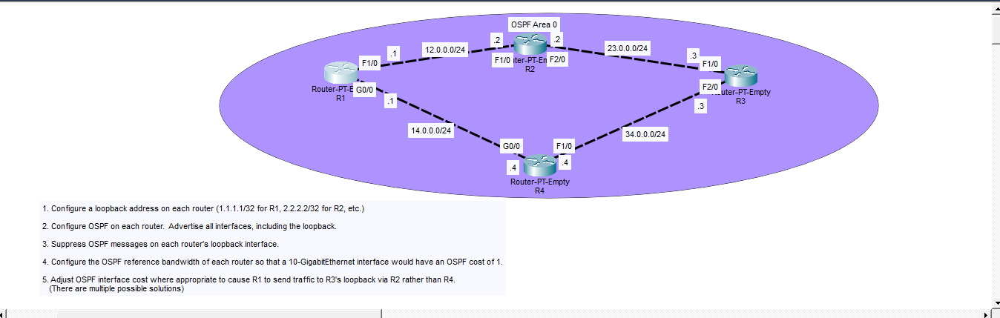
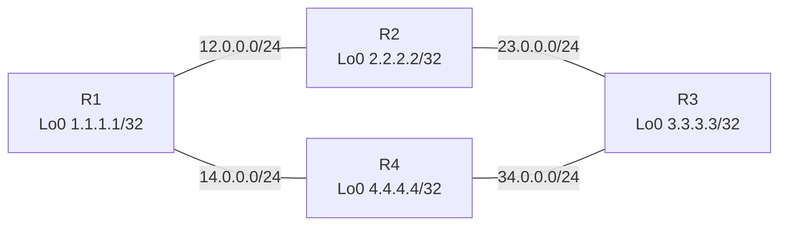
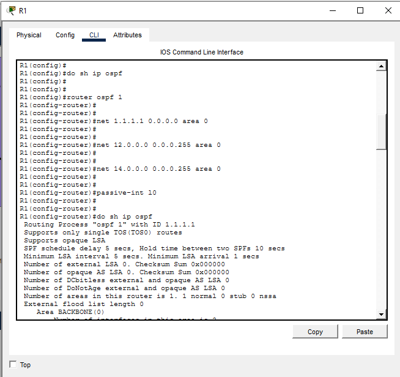
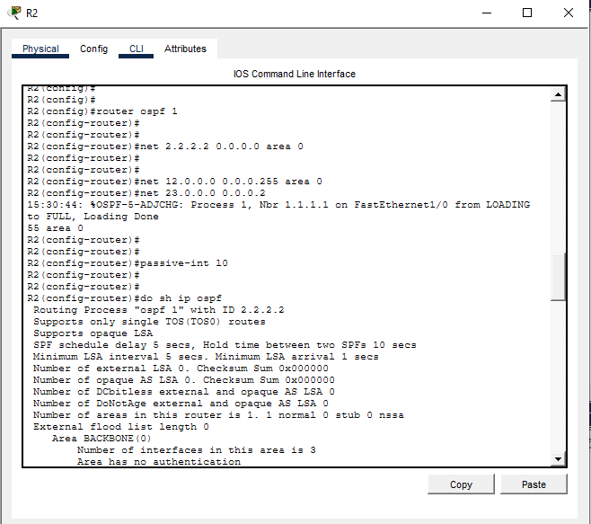
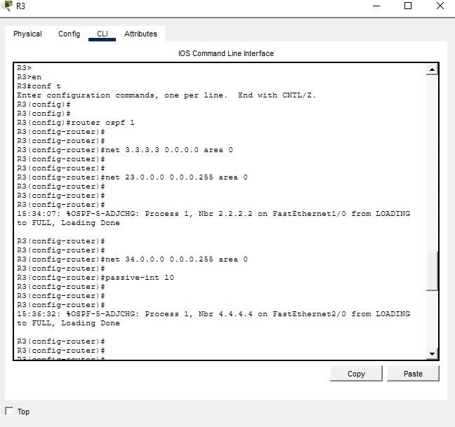
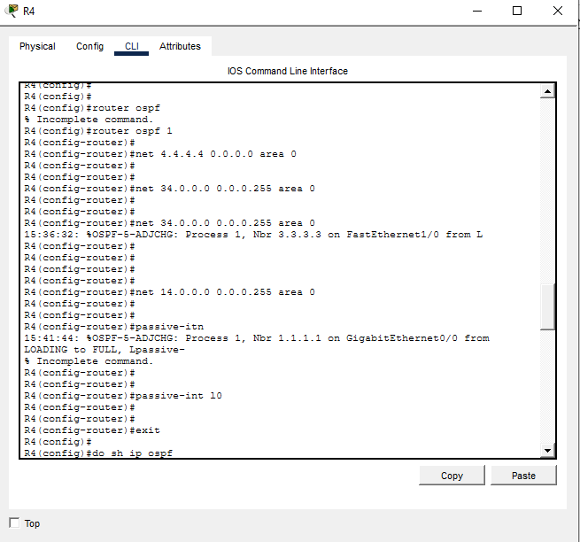
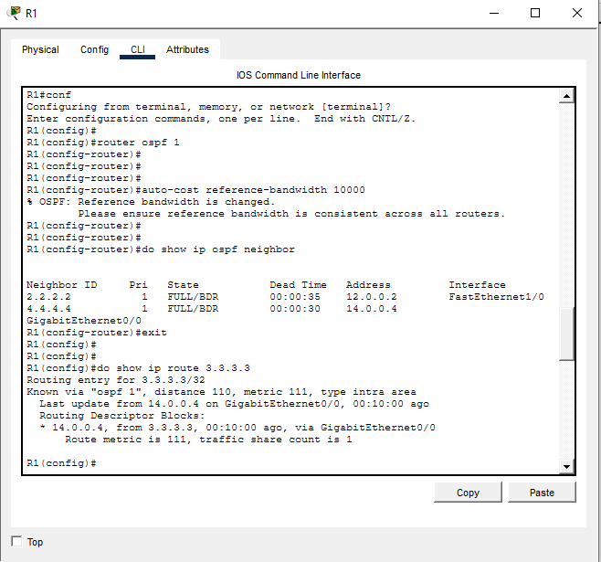

# Single-Area OSPF, Reference Bandwidth and Path Selection

## Overview

This Cisco Packet Tracer lab builds a four-router **single-area OSPF** topology in **area 0**. The lab covers loopback advertisement, passive interfaces, OSPF neighbor formation, reference-bandwidth tuning, route verification, and manual OSPF cost manipulation.

The final path-selection objective is to make R1 prefer the path to R3's loopback through **R2** instead of **R4**.

## Topics practiced

- OSPF process configuration
- Area 0 / backbone area
- OSPF router IDs
- `network` statements and wildcard masks
- Loopback advertisement
- Passive interfaces
- OSPF neighbor adjacencies
- DR/BDR states on broadcast links
- OSPF reference bandwidth
- Automatic OSPF cost calculation
- Manual `ip ospf cost`
- OSPF route selection and verification

## Topology





## Addressing plan

| Link / Interface | Network / Address |
|---|---|
| R1–R2 | `12.0.0.0/24` |
| R2–R3 | `23.0.0.0/24` |
| R3–R4 | `34.0.0.0/24` |
| R4–R1 | `14.0.0.0/24` |
| R1 Loopback0 | `1.1.1.1/32` |
| R2 Loopback0 | `2.2.2.2/32` |
| R3 Loopback0 | `3.3.3.3/32` |
| R4 Loopback0 | `4.4.4.4/32` |

## OSPF design

All routers use:

```cisco
router ospf 1
```

The process ID is locally significant; I used `1` on every router for consistency.

Router IDs:

```text
R1 → 1.1.1.1
R2 → 2.2.2.2
R3 → 3.3.3.3
R4 → 4.4.4.4
```

The OSPF `network` command matches **local interfaces** that should participate in OSPF. Remote networks are learned automatically from OSPF neighbors.

## R1 configuration

```cisco
router ospf 1
 network 1.1.1.1 0.0.0.0 area 0
 network 12.0.0.0 0.0.0.255 area 0
 network 14.0.0.0 0.0.0.255 area 0
 passive-interface Loopback0
 auto-cost reference-bandwidth 10000
```



## R2 configuration

```cisco
router ospf 1
 network 2.2.2.2 0.0.0.0 area 0
 network 12.0.0.0 0.0.0.255 area 0
 network 23.0.0.0 0.0.0.255 area 0
 passive-interface Loopback0
 auto-cost reference-bandwidth 10000
```



## R3 configuration

```cisco
router ospf 1
 network 3.3.3.3 0.0.0.0 area 0
 network 23.0.0.0 0.0.0.255 area 0
 network 34.0.0.0 0.0.0.255 area 0
 passive-interface Loopback0
 auto-cost reference-bandwidth 10000
```



## R4 configuration

```cisco
router ospf 1
 network 4.4.4.4 0.0.0.0 area 0
 network 14.0.0.0 0.0.0.255 area 0
 network 34.0.0.0 0.0.0.255 area 0
 passive-interface Loopback0
 auto-cost reference-bandwidth 10000
```



## Passive loopbacks

Each loopback is advertised in OSPF but does not send OSPF Hello packets:

```cisco
passive-interface Loopback0
```

This allows the `/32` loopback route to be advertised without attempting to form an OSPF neighbor on the loopback interface.

## OSPF reference bandwidth

The lab requires a **10-Gigabit interface to have OSPF cost 1**:

```cisco
auto-cost reference-bandwidth 10000
```

The value is in Mbps, so `10000 Mbps = 10 Gbps`.

Approximate automatic costs:

| Interface speed | OSPF cost |
|---|---:|
| 10 Gbps | 1 |
| 1 Gbps | 10 |
| 100 Mbps | 100 |
| 10 Mbps | 1000 |

Rule:

```text
OSPF cost = reference bandwidth / interface bandwidth
```

## Neighbor verification

On R1, OSPF formed neighbors with R2 and R4:

```text
Neighbor ID     State       Address     Interface
2.2.2.2         FULL/BDR    12.0.0.2    FastEthernet1/0
4.4.4.4         FULL/BDR    14.0.0.4    GigabitEthernet0/0
```



## Initial route to R3 loopback

Before manually changing an interface cost, R1 reached `3.3.3.3/32` through R4:

```text
Known via "ospf 1", distance 110, metric 111, type intra area
Last update from 14.0.0.4 on GigabitEthernet0/0
```

This proves the initial path was:

```text
R1 → R4 → R3
```

The path through R4 was cheaper because R1's GigabitEthernet link toward R4 had a lower automatic OSPF cost than the FastEthernet link toward R2.

## Manual OSPF cost override

`auto-cost reference-bandwidth` changes the automatic cost formula. A manual interface cost overrides that calculated value:

```cisco
interface GigabitEthernet0/0
 ip ospf cost 200
```

Concept:

```text
auto-cost reference-bandwidth
    → automatic cost rule

ip ospf cost <value>
    → manual per-interface override
```

OSPF chooses the path with the **lowest total accumulated cost**.

The final objective is for R1 to prefer:

```text
R1 → R2 → R3
```

Verify with:

```cisco
show ip ospf interface brief
show ip route 3.3.3.3
traceroute 3.3.3.3
```

For the objective to be complete, R1 should use `12.0.0.2` as the next hop toward R3's loopback.

## Verification commands

```cisco
show ip interface brief
show ip ospf
show ip ospf interface brief
show ip ospf neighbor
show ip route ospf
show ip route 3.3.3.3
show ip protocols
show running-config | section router ospf
traceroute 3.3.3.3
```

## What I learned

This lab reinforced that OSPF route selection depends on **total path cost**, not simply hop count.

I practiced matching only locally connected interfaces with OSPF `network` statements, advertising loopbacks while suppressing Hellos with passive interfaces, verifying FULL OSPF adjacencies, changing the reference bandwidth so modern interface speeds receive meaningful costs, and distinguishing between automatic cost calculation and a manual interface-cost override.

The key rule is:

> OSPF chooses the path with the lowest total accumulated cost. A manually configured `ip ospf cost` overrides the automatically calculated interface cost.

## Repository structure

```text
OSPF-Single-Area-Cost-Path-Selection/
├── README.md
├── OSPF-Single-Area-Cost-Path-Selection.pkt
└── screenshots/
    ├── topology-and-objectives.png
    ├── r1-basic-ospf-config.png
    ├── r1-neighbors-and-route-before-cost-change.png
    ├── r2-ospf-config.png
    ├── r3-ospf-config.png
    └── r4-ospf-config.png
```

Add your completed `.pkt` file before pushing to GitHub.

## Status

- Loopback addressing: ✅
- OSPF area 0: ✅
- Directly connected OSPF networks advertised: ✅
- Passive loopbacks: ✅
- Neighbor adjacencies: ✅ verified on R1
- Reference bandwidth: ✅ configured/documented
- Initial path via R4: ✅ verified
- Final forced path via R2: ⚠️ add final verification screenshot after confirming the route
