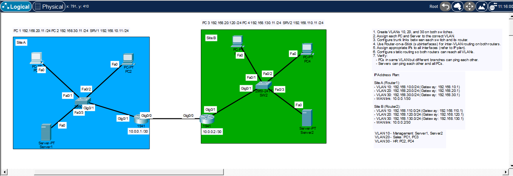
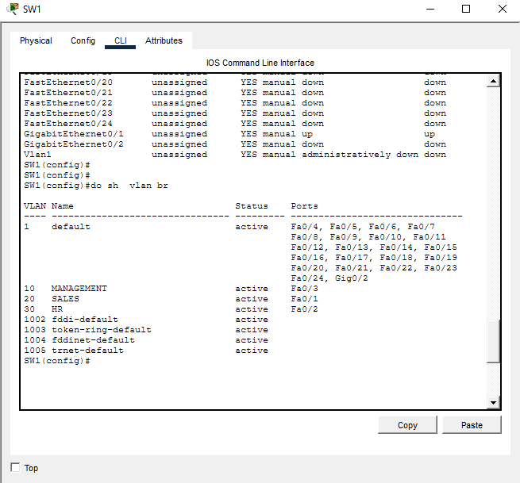
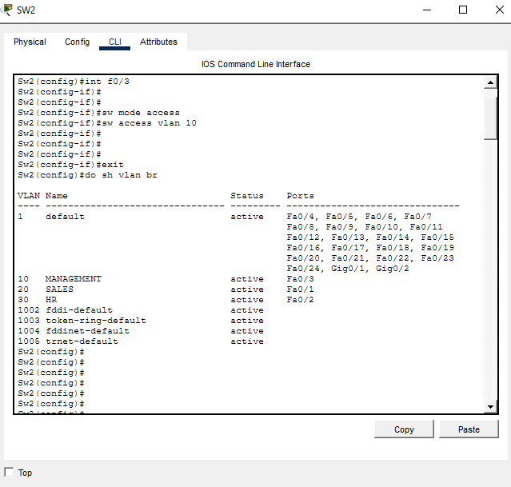
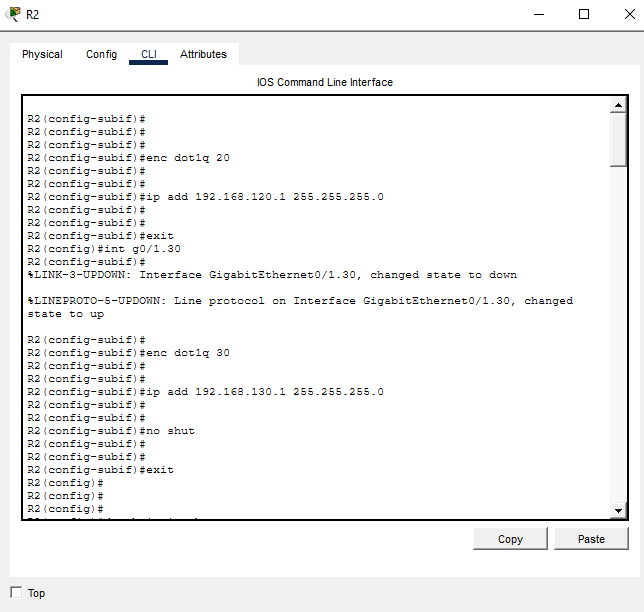
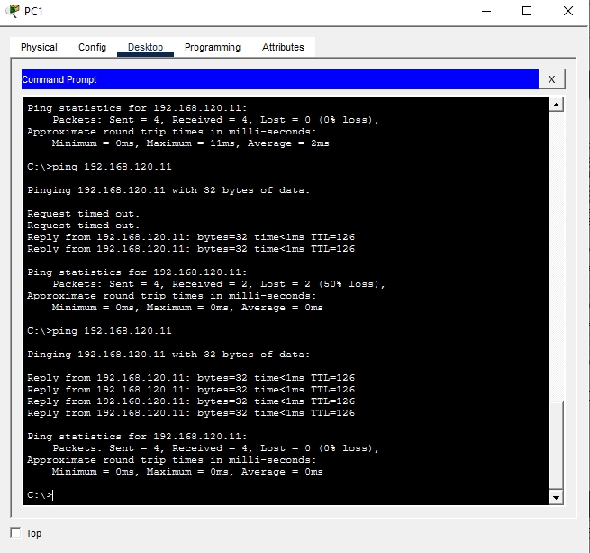

# CCNA VLAN, Trunking, Router-on-a-Stick & Static Routing Lab

A two-site Cisco Packet Tracer lab built to practice several core CCNA skills in one topology:

- VLAN creation and naming
- Access-port assignment
- 802.1Q trunking
- Allowed VLAN lists
- Router-on-a-Stick (ROAS)
- IPv4 addressing
- /30 WAN subnetting
- Static routing
- End-to-end verification
- Troubleshooting routed VLAN connectivity

> **Lab completion time:** ~70 minutes including troubleshooting.

---

## Topology



The lab contains two branch sites connected by a point-to-point WAN link.

### VLAN Plan

| VLAN | Name | Site A subnet | Site B subnet |
|---:|---|---|---|
| 10 | MANAGEMENT | `192.168.10.0/24` | `192.168.110.0/24` |
| 20 | SALES | `192.168.20.0/24` | `192.168.120.0/24` |
| 30 | HR | `192.168.30.0/24` | `192.168.130.0/24` |

### WAN

| Device | Interface | Address |
|---|---|---|
| R1 | G0/0 | `10.0.0.1/30` |
| R2 | G0/0 | `10.0.0.2/30` |

WAN subnet: `10.0.0.0/30`

---

## 1. Create the VLANs

The same VLAN IDs are created on both switches.

```cisco
vlan 10
 name MANAGEMENT

vlan 20
 name SALES

vlan 30
 name HR
```

### Verify

```cisco
show vlan brief
```

### SW1 Verification



### SW2 Verification



---

## 2. Configure Access Ports

### SW1

```cisco
interface fa0/1
 switchport mode access
 switchport access vlan 20

interface fa0/2
 switchport mode access
 switchport access vlan 30

interface fa0/3
 switchport mode access
 switchport access vlan 10
```

### SW2

```cisco
interface fa0/1
 switchport mode access
 switchport access vlan 20

interface fa0/2
 switchport mode access
 switchport access vlan 30

interface fa0/3
 switchport mode access
 switchport access vlan 10
```

---

## 3. Configure the Switch-to-Router Trunks

The switch uplink carries VLANs 10, 20, and 30.

```cisco
interface g0/1
 switchport mode trunk
 switchport trunk allowed vlan 10,20,30
```

### Verify

```cisco
show interfaces trunk
```

### Native VLAN Note

No custom native VLAN was required in this lab. The trunk uses the default native VLAN behavior, while VLANs 10, 20, and 30 are carried with 802.1Q tags.

---

## 4. Configure Router-on-a-Stick

The physical interface itself does not receive an IPv4 address. Each VLAN receives its own router subinterface.

### R1

```cisco
interface g0/1
 no shutdown

interface g0/1.10
 encapsulation dot1Q 10
 ip address 192.168.10.1 255.255.255.0

interface g0/1.20
 encapsulation dot1Q 20
 ip address 192.168.20.1 255.255.255.0

interface g0/1.30
 encapsulation dot1Q 30
 ip address 192.168.30.1 255.255.255.0
```

### R2

```cisco
interface g0/1
 no shutdown

interface g0/1.10
 encapsulation dot1Q 10
 ip address 192.168.110.1 255.255.255.0

interface g0/1.20
 encapsulation dot1Q 20
 ip address 192.168.120.1 255.255.255.0

interface g0/1.30
 encapsulation dot1Q 30
 ip address 192.168.130.1 255.255.255.0
```



### Verify

```cisco
show ip interface brief
```

Expected behavior:
- Physical G0/1: `up/up`
- G0/1.10: `up/up`
- G0/1.20: `up/up`
- G0/1.30: `up/up`

---

## 5. Configure the WAN Link

### R1

```cisco
interface g0/0
 ip address 10.0.0.1 255.255.255.252
 no shutdown
```

### R2

```cisco
interface g0/0
 ip address 10.0.0.2 255.255.255.252
 no shutdown
```

### /30 Addressing Review

For `10.0.0.0/30`:

| Address | Purpose |
|---|---|
| `10.0.0.0` | Network address |
| `10.0.0.1` | Usable host - R1 |
| `10.0.0.2` | Usable host - R2 |
| `10.0.0.3` | Broadcast address |

A `/30` subnet has a block size of 4:

```text
10.0.0.0/30
10.0.0.4/30
10.0.0.8/30
10.0.0.12/30
...
```

---

## 6. Configure End Devices

Each PC/server uses:
- an address from its local VLAN subnet
- mask `255.255.255.0`
- the corresponding router subinterface as the default gateway

Example Site A SALES host:

```text
IP address:      192.168.20.11
Subnet mask:     255.255.255.0
Default gateway: 192.168.20.1
```

Example Site B SALES host:

```text
IP address:      192.168.120.11
Subnet mask:     255.255.255.0
Default gateway: 192.168.120.1
```

---

## 7. Test Local Connectivity First

Recommended validation order:

```text
Host -> own default gateway
Host -> same VLAN/local device
Host -> different VLAN at the same site
R1   -> R2 WAN address
```

WAN test:

```cisco
R1# ping 10.0.0.2
R2# ping 10.0.0.1
```

The first ICMP echo can fail while ARP resolves the next-hop MAC address.

---

## 8. Configure Static Routing

The routers initially know only their directly connected networks.

### R1 -> Site B

```cisco
ip route 192.168.110.0 255.255.255.0 10.0.0.2
ip route 192.168.120.0 255.255.255.0 10.0.0.2
ip route 192.168.130.0 255.255.255.0 10.0.0.2
```

### R2 -> Site A

```cisco
ip route 192.168.10.0 255.255.255.0 10.0.0.1
ip route 192.168.20.0 255.255.255.0 10.0.0.1
ip route 192.168.30.0 255.255.255.0 10.0.0.1
```

### Verify

```cisco
show ip route
```

Useful route codes:

```text
C = Connected
L = Local
S = Static
```

---

# Troubleshooting Encountered

## Issue 1 - Incorrect /30 Host Address

### Symptom

An attempt was made to configure:

```cisco
ip address 10.0.0.4 255.255.255.252
```

IOS rejected it because `10.0.0.4` is a subnet/network address.

### Cause

For `10.0.0.0/30`:

```text
10.0.0.0 = network
10.0.0.1 = usable
10.0.0.2 = usable
10.0.0.3 = broadcast
```

The next subnet begins at `10.0.0.4/30`.

### Lesson

For `/30`, remember the network increments:

```text
0, 4, 8, 12, 16...
```

---

## Issue 2 - Local Gateway Worked, Remote Branch Failed

### Symptom

A Site A SALES host could ping:

```text
192.168.20.1
```

but initially could not ping the Site B SALES host:

```text
192.168.120.11
```

The reply came from the local gateway:

```text
Reply from 192.168.20.1: Destination host unreachable.
```

### Diagnosis

That message proved:
1. the PC could reach R1
2. the local access VLAN was working
3. the trunk and ROAS path were working
4. R1 did not yet know how to reach `192.168.120.0/24`

### Root Cause

The two sites reuse the same VLAN IDs, but use different Layer 3 subnets:

```text
Site A VLAN 20 -> 192.168.20.0/24
Site B VLAN 20 -> 192.168.120.0/24
```

Same VLAN ID does not make two routed sites the same IP network.

### Fix

Static routes were configured in both directions for all remote VLAN networks.

---

## Issue 3 - Same VLAN ID Does Not Mean Same Subnet

This lab reinforced a major CCNA rule:

```text
Different IP subnet = routing required
```

Even when the VLAN number is the same.

Traffic follows:

```text
PC
 |
Access port
 |
VLAN
 |
802.1Q trunk
 |
Router subinterface
 |
Static route
 |
WAN
 |
Remote router
 |
Remote VLAN
 |
Remote host
```

---

## Final Verification

After the static routes were installed, end-to-end communication succeeded.



---

# Useful Verification Commands

```cisco
show vlan brief
show interfaces trunk
show ip interface brief
show ip route
show running-config
ping <destination>
```

---

# CCNA Skills Practiced

- [x] VLAN creation
- [x] VLAN naming
- [x] Access-port configuration
- [x] 802.1Q trunking
- [x] Allowed VLAN configuration
- [x] Router-on-a-Stick
- [x] Inter-VLAN routing
- [x] IPv4 addressing
- [x] /30 subnetting
- [x] Static routing
- [x] Routing-table interpretation
- [x] Connectivity verification
- [x] Layer 2 vs Layer 3 troubleshooting
- [x] End-to-end packet-path analysis

---

## Key Takeaways

1. A VLAN ID and an IP subnet are different concepts.
2. Different IP subnets require Layer 3 routing.
3. Router-on-a-Stick uses one physical interface with multiple 802.1Q subinterfaces.
4. The switch-facing router link must carry the required VLAN tags.
5. `/30` networks provide exactly two usable IPv4 host addresses.
6. A successful gateway ping helps isolate a failure above the local Layer 2 path.
7. `show ip route` is essential when local connectivity works but remote connectivity fails.
8. Troubleshooting should follow the packet path instead of changing random configuration.

---

## Lab Result

**Status:** Completed successfully  
**Time:** ~70 minutes including troubleshooting  
**Environment:** Cisco Packet Tracer  
**Level:** CCNA 200-301 practice
